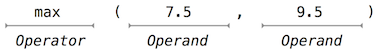
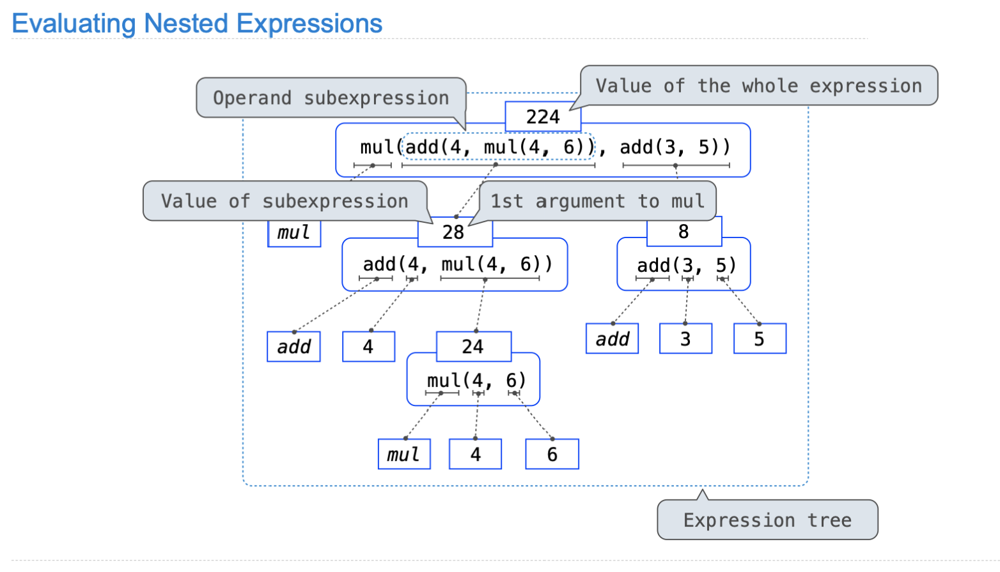

# What is CS61A about?

A course about managing  complexity

- Mastering abstraction
- Programming paradigms

An introduction to programming

- Full understanding of Python fundamentals!

- Combining multiple ideas in large projects
- How computers interpret promgramming languages

 Different typed of languages: Scheme & SQL

---

# Lab00

## Python Interpreter

We can use the terminal to check if your Python 3 interpreter was installed correctly. Try the following command:

```shell
python3
```

If the installation worked, you should see some text printed out about the interpreter followed by `>>>` on its own line. This is where you can type in Python code. Try typing some expressions you saw in lecture, or just play around to see what happens! You can type `exit()` or `Ctrl-D` to return to your command line.

## Python Command Lines Options

link: https://docs.python.org/3.4/using/cmdline.html

Some frequently-used：

- **`-i`**：The `-i` option runs your Python script, then opens an interactive session. In an interactive session, you run Python code line by line and get immediate feedback instead of running an entire file all at once. To exit, type `exit()` into the interpreter prompt. You can also use the keyboard shortcut `Ctrl-D` on Linux/Mac machines or `Ctrl-Z Enter` on Windows.

  If you edit the Python file while running it interactively, you will need to exit and restart the interpreter in order for those changes to take effect.

```shell
python3 -i 
```


- **`-m doctest`**: Runs doctests in a particular file. Doctests are surrounded by triple quotes (`"""`) within functions.

  Each test in the file consists of `>>>` followed by some Python code and the expected output (though the `>>>` are not seen in the output of the doctest command).

```shell
 python3 -m doctest
```

Example:

ex.py

```py
"""Our first Python source file"""

from operator import floordiv, mod

def divide_exact(n, d=10):
    """
    Return the quotient and remainder of dividing N by D.
    >>> q,r = divide_exact(2013, 10)
    >>> q
    201
    >>> r
    2
    """
    return floordiv(n, d), mod(n, d)                                                          
```

```shell
# miyu @ JcqMBP in ~/CS/Python(ing)/UCB-CS61A/Lectures [16:14:55] 
$ python3 -i ex.py 
>>> q, r = divide_exact(2020)
>>> q
202
>>> r
0
>>> ^D

# miyu @ JcqMBP in ~/CS/Python(ing)/UCB-CS61A/Lectures [16:15:29] 
$ python3 -m doctest ex.py 
**********************************************************************
File "/Users/miyu/CS/Python(ing)/UCB-CS61A/Lectures/ex.py", line 11, in ex.divide_exact
Failed example:
    r
Expected:
    2
Got:
    3
**********************************************************************
1 items had failures:
   1 of   3 in ex.divide_exact
***Test Failed*** 1 failures.
"如果 doctest 成功，是不会显示的，会显示错误的示
"要想成功也显示，则需要" python3 -m doctest -v ex.py 
```

# Lab01

## Debugging

[link](https://inst.eecs.berkeley.edu/~cs61a/fa20/articles/debugging.html)

Example:

```shell
Traceback (most recent call last):
  File "<pyshell#29>", line 3 in <module>
    result = buggy(5)
  File <pyshell#29>", line 5 in buggy
    return f + x
TypeError: unsupported operand type(s) for +: 'function' and 'int'
```

### Traceback Messages

1. The **first** line in such a pair has the following format:

```shell
File "<file name>", line <number>, in <function>
```

- **File name**: the name of the file that contains the problem.

- **Number**: the line number in the file that caused the problem, or the line number that contains the next function call
- **Function**: the name of the function in which the line can be found.

2. The **second** line in the pair (it's indented farther in than the first) displays the actual line of code that makes the *next* function call. 

Finally, remember that the traceback is organized with the "most recent call last.”

### <span id="error_message">Error Messages</span>

The very last line in the traceback message is the error statement.

```shell
<error type>: <error message>
```

- **Error type**: the type of error that was caused (e.g. `SyntaxError`, `TypeError`). These are usually descriptive enough to help you narrow down your search for the cause of error.
- **Error message**: a more detailed description of exactly what caused the error. Different error types produce different error messages.

## Debugging Techniques

### Running doctests

### Writing your own tests

1.  write additional doctests
2. write testing functions

Some advice in writing tests:

- **Write some tests before you write code**: this is called test-driven development. Writing down how you expect the function to behave first -- this can guide you when writing the actual code.

- **Write more tests after you write code**: once you are sure your code passes the initial doctests, write some more tests to take care of **edge cases**.

- **Test edge cases**: make sure your code works for all special cases.

### Using `print` statements

Some advice:

- Don't just print out a variable -- add some sort of message to make it easier for you to read:

  ```
  print(tmp)   # harder to keep track
  print('DEBUG: tmp was this:', tmp)  # easier
  ```

- Use `print` statements to view the results of function calls (i.e. after function calls).

- Use `print` statements at the end of a `while` loop to view the state of the counter variables after each iteration:

  ```
  i = 0
  while i < n:
      i += func(i)
      print('DEBUG: i is', i)
  ```

- Don't just put random `print` statements after lines that are obviously correct.

#### Long-term debugging -- `debug` flag

```py
debug = True

def foo(n):
i = 0
while i < n:
    i += func(i)
    if debug:
        print('DEBUG: i is', i)
```

whenever we want to do some debugging, we can set the global `debug` variable to `True`, and when we don't want to see any debugging input, we can turn it to `False` (such a variable is called a "flag").

### Interactive Debugging

you can run the follow command and one then has a session of python where all the definitions of `file.py` have already been executed

```shell
python -i file.py
```

### PythonTutor Debugging

### Using `assert` statements

Python has a feature known as an `assert` statement, which lets you test that a condition is true, and print an error message otherwise in a single line.

```py
# example
def double(x):
    assert isinstance(x, int), "The input to double(x) must be an integer"
    return 2 * x
```

> One *major* benefit of assert statements is that they are more than a debugging tool, you can leave them in code permanantly. A key principle in software development is that it is generally better for code to crash than produce an incorrect result, and having asserts in your code makes it far more likely that your code will crash if it has a bug in it.

## Error Types

[Error Massages](#error_message)

| Error Types                 | Descriptions                                                 |
| :-------------------------- | :----------------------------------------------------------- |
| SyntaxError                 | Contained improper syntax (e.g. missing a ==colon== after an `if` statement or forgetting to ==close parentheses/quotes==) |
| IndentationError (缩进错误) | Contained improper indentation (e.g. inconsistent indentation of a function body) |
| TypeError                   | Attempted operation on incompatible types (e.g. trying to add a function and a number) or called function with the wrong number of arguments or forgetting a return statement |
| ZeroDivisionError           | Attempted division by zero                                   |
| NameError                   | Variable not assigned to anything OR it doesn't exist. This includes function names |
| IndexError                  | trying to index a sequence (e.g. a tuple, list, string) with a number that exceeds the size of the sequence. |

# Lab02

## [Lambda Expressions](# 1.6.7  Lambda Expressions)


## Evironment Diagrams

### :warning: attention

```py
def cycle(f1, f2, f3):
    func_li = [f1, f2, f3]
    def func1(n):
        def func2(x):
            num = n
            while num != 0:
                x = func_li[n%3](x)
                num -= 1 """不能修改 n，因此赋 num 的值为 n，然后修改 num"""
            return x
        return func2
    return func1
"""下面的错误师范"""
      def func1(n):
    #     def func2(x):
    #         while n != 0:
    #             x = func_li[n%3](x) # 循环迭代
                  n -= 1 "这里除了问题, 不要尝试在局部函数中修改外部变量, 在 python 中是允许的"
    #         return x
    #     return func2
    # return func1
```


---

# CHAPTER 1

##  1.2 Elements of Programming

### **expression**

表达式expression，不是语句 statement

### **call expression**



1. **function**

- functions may take an arbitrary number of arguments:

  ```py
  >>> max(1, -2, 3, -4)
  3
  ```

- Second, function notation extends in a straightforward way to *nested* expressions, where the elements are themselves compound expressions.

  ```py
  >>> max(min(1, -2), min(pow(3, 5), -4))
  -2
  ```

- mathematical notation has a great variety of forms

2. **Importing Library Functions**

- the `math` module provides a variety of familiar mathematical functions:

  ```py
  >>> from math import sqrt
  >>> sqrt(256)
  16.0
  ```

- the `operator` module provides access to functions corresponding to infix operators:

  ```py
  >>> from operator import add, sub, mul
  >>> add(14, 28)
  42
  >>> sub(100, mul(7, add(8, 4)))
  16
  ```

> An `import` statement designates a module name (e.g., `operator` or `math`), and then lists the named attributes of that module to import (e.g., `sqrt`).
>
> [Python3 Library Docs](http://docs.python.org/py3k/library/index.html)

### Names and the Environment

1. **Names**(*variable names* or *variables*)

If a value has been given a name, we say that the name *binds* to the value.

- we can establish new bindings using the assignment statement, which contains a name to the left of `=` and a value to the right:

  ```py
  >>> radius = 10
  >>> radius
  10
  >>> 2 * radius
  20
  ```

  

- Names are also bound via `import` statements.

  ```py
  >>> from math import pi
  >>> pi * 71 / 223
  1.0002380197528042
  ```

- Names can also be bound to functions. 

  Functions, unlike numbers, are tricky to render as text, so Python prints an identifying description instead, when asked to describe a function

  ```py
  >>> max
  <built-in function max>
  ```

  We can use assignment statements to give new names to existing functions.

  ```py
  >>> f = max
  >>> f
  <built-in function max>
  >>> f(2, 3, 4)
  4
  ```

  And successive assignment statements can rebind a name to a new value.<!--反复横跳-->

  ```py
  >>> f = 2
  >>> f
  2
  ```

 When a name is bound to a new value through assignment, it is no longer bound to any previous value. One can even bind built-in names to new values.

```py
>>> max = 5
>>> max
5
# After assigning max to 5, the name max is no longer bound to a function, and so attempting to call max(2, 3, 4) will cause an error.
```

When executing an assignment statement, Python evaluates the expression to the right of `=` **before** changing the binding to the name on the left. 

```py
>>> x = 2
>>> x = x + 1
>>> x
3
```

We can also assign multiple values to multiple names in a single statement, where names on the left of `=` and expressions on the right of `=` are separated by commas(逗号).

```py
>>> area, circumference = pi * radius * radius, 2 * pi * radius
>>> area
314.1592653589793
>>> circumference
62.83185307179586
```

Changing the value of one name does not affect other names.

```py
>>> radius = 11
>>> area
314.1592653589793
>>> area = pi * radius * radius
380.132711084365
```

With multiple assignment, *all* expressions to the right of `=` are evaluated before *any* names to the left are bound to those values. As a result of this rule, <u>swapping the values bound to two names can be performed in a single statement.</u>

```py
>>> x, y = 3, 4.5
# swapping
>>> y, x = x, y
>>> x
4.5
>>> y
3
```

2. [**Evironment**](#env)

The possibility of binding names to values and later retrieving those values by name means that the interpreter must maintain some sort of memory that keeps track of the names, values, and bindings. This memory is called an *environment*.

### Evaluating Nested Expressions

```py
>>> from operator import mul,add
>>> mul(add(4,mul(4,6)),add(3,5))
224
```




[Pythontutor](https://pythontutor.com/composingprograms.html#mode=edit): to see the multiple environments of a program

### The Non-Pure Print Function

**Pure functions**:

Pure functions have the property that applying them has no effects beyond returning a value. 

Moreover, a pure function must always return the same value when called twice with the same arguments.

```py
>>> abs(-2)
2
```

benefits of pure function：

- First, pure functions can be composed more reliably into compound call expressions. 
- Second, pure functions tend to be simpler to test
- Third, Chapter 4 will illustrate that pure functions are essential for writing *concurrent* programs, in which multiple call expressions may be evaluated simultaneously.

**Non-pure functions**

In addition to returning a value, applying a non-pure function can generate *side effects*, which make some change to the state of the interpreter or computer. 

A common side effect is to generate ==additional output beyond the return value==, using the `print` function.

```py
>>> print(1, 2, 3)
1 2 3 # 输出的是返回值以外的输出
```

The value that `print` returns is always `None`

**The interactive Python interpreter does not automatically print the value `None`.** 

```py
>>> None
>>> print(None)
None
```

The fact that `print` returns `None` means that it *should not* be the expression in an assignment statement.

In the case of `print`, the function itself is printing output as a side effect of being called.

```py
>>> print(print(1), print(2))
1
2
None None # 最外层 print 打印输出

>>> two = print(2)
2
>>> print(two)
None
```

## 1.3 Defining New Functions

**How to define a function.** Function definitions consist of a `def` statement that indicates a `<name>`and a comma-separated list of named `<formal parameters>`, then a `return` statement, called the function body, that specifies the `<return expression>` of the function, which is an expression to be evaluated whenever the function is applied:

```py
def <name>(<formal parameters>):
    return <return expression>
```

==The second line *must* be indented — most programmers use four spaces to indent.==

The return expression is not evaluated right away; it is stored as part of the newly defined function and evaluated only when the function is eventually applied.

```py
>>> def square(x):
        return mul(x, x)
"""Having defined square, we can apply it with a call expression:"""
>>> square(21)
441
>>> square(add(2, 5))
49
>>> square(square(3))
81

""" We can also use square as a building block in defining other functions."""
>>> def sum_squares(x, y):
        return add(square(x), square(y))
>>> sum_squares(3, 4)
25
```

> User-defined functions are used in exactly the same way as built-in functions. Indeed, one cannot tell from the definition of `sum_squares` whether `square` is built into the interpreter, imported from a module, or defined by the user.

Both `def` statements and assignment statements bind names to values, and any existing bindings are lost.

```py
>>> def g():
        return 1
>>> g()
1
>>> g = 2
>>> g
2
>>> def g(h, i):
        return h + i
>>> g(1, 2)
3
```

### <span id="env">Environments</span>

#### Frame:

An environment in which an expression is evaluated consists of a sequence of *frames*, depicted as boxes. 

Each frame contains *bindings*, each of which associates a name with its corresponding value. 

- ***global* frame**

  

- ***environment diagram*** 
- **function name**

The name of a function is repeated twice, once in the frame and again as part of the function itself. 

The name appearing in the function is called the ***intrinsic name***. The name in a frame is a ***bound name***. There is a difference between the two: 

different names may refer to the same function, but that function itself has only one intrinsic name.

- **Function Signatures**

Functions differ in the number of arguments that they are allowed to take. To track these requirements, we draw each function in a way that shows the function name and its formal parameters. The user-defined function `square` takes only `x`; providing more or fewer arguments will result in an error. 

A description of the formal parameters of a function is called the function's signature.

The function `max` can take an arbitrary number of arguments. It is rendered as `max(...)`. 

=> Regardless of the number of arguments taken, ==all built-in functions will be rendered as `<name>(...)`==, because these primitive functions were never explicitly defined.


### Calling User-Defined Functions

Applying a user-defined function introduces a second *local* frame, which is only accessible to that function.

The environment in which the body is evaluated consists of two frames: 

- first the local frame that contains formal parameter bindings, 
- then the global frame that contains everything else. 

Each instance of a function application has its own independent local frame.

The "Return value" in the `square()` frame is not a name binding; instead it indicates the value returned by the function call that created the frame.


**Name Evaluation**: A name evaluates to the value bound to that name in the earliest frame of the current environment in which that name is found.

Names are bound to values, which are distributed across many independent local frames, along with a single global frame that contains shared names.

A new local frame is introduced every time a function is called, even if the same function is called twice.

### Local Names

We say that the *scope* of a local name is limited to the body of the user-defined function that defines it. When a name is no longer accessible, it is out of scope. This scoping behavior isn't a new fact about our model; it is a consequence of the way environments work.

### Choosing Names

1. Function names are lowercase, with words separated by underscores. Descriptive names are encouraged.
2. Function names typically evoke operations applied to arguments by the interpreter (e.g., `print`, `add`, `square`) or the name of the quantity that results (e.g., `max`, `abs`, `sum`).
3. Parameter names are lowercase, with words separated by underscores. Single-word names are preferred.
4. Parameter names should evoke the role of the parameter in the function, not just the kind of argument that is allowed.
5. Single letter parameter names are acceptable when their role is obvious, but avoid "l" (lowercase ell), "O" (capital oh), or "I" (capital i) to avoid confusion with numerals.

### Functions as Abstractions

A function definition should be able to suppress details.

**Aspects of a functional abstraction.** To master the use of a functional abstraction, it is often useful to consider its three core attributes. 

- The *domain* of a function is the set of arguments it can take.
-  The *range* of a function is the set of values it can return.
-  The *intent* of a function is the relationship it computes between inputs and output (as well as any side effects it might generate). 

Understanding functional abstractions via their domain, range, and intent is critical to using them correctly in a complex program.

### Operators

- division
  - / --- truediv
  - //--- floordiv

```py
# normal division: /
>>> 5 / 4
1.25
>>> 8 / 4
2.0
# rounds the result down to an integer: //
>>> 5 // 4
1
>>> -5 // 4
-2

>>> from operator import truediv, floordiv
>>> truediv(5, 4) # equal to 5 / 4
1.25
>>> floordiv(5, 4) # equal tp 5 // 4
1
```


## 1.4  Designing Functions

A good function: Fundamentally, the qualities of good functions all reinforce the idea that functions are abstractions.

- [ ] Each function should have exactly one job.

  That job should be identifiable with a short name and characterizable in a single line of text. Functions that perform multiple jobs in sequence should be divided into multiple functions.

- [ ] *Don't repeat yourself* (DRY) is a central tenet of software engineering.

  The so-called DRY principle states that multiple fragments of code should not describe redundant logic. Instead, that logic should be implemented once, given a name, and applied multiple times.

- [ ] Functions should be defined generally

  Squaring is not in the Python Library precisely because it is a special case of the `pow` function, which raises numbers to arbitrary powers.

> Decomposing a complex task into concise functions

### Documentation

#### ***docstring***

A function definition will often include documentation describing the function, called a *docstring*, <u>which must be indented along with the function body</u>

会出现在 help 中

```py
Docstrings are conventionally triple quoted. 
''' docstring '''
""" docstring """

>>>def pressure(v, t, n):
        """Compute the pressure in pascals of an ideal gas.

        Applies the ideal gas law: http://en.wikipedia.org/wiki/Ideal_gas_law

        v -- volume of gas, in cubic meters
        t -- absolute temperature in degrees kelvin
        n -- particles of gas
        """
        k = 1.38e-23  # Boltzmann's constant
        return n * k * t / v
```

When you call `help` with the name of a function as an argument, you see its docstring (type `q` to quit Python help).

```py
>>> help(pressure)
Compute the pressure in pascals of an ideal gas.

Applies the ideal gas law: http://en.wikipedia.org/wiki/Ideal_gas_law

v -- volume of gas, in cubic meters
t -- absolute temperature in degrees kelvin
n -- particles of gas
# type `q` to quit Python help
```

[docstring guidelines](http://www.python.org/dev/peps/pep-0257/)

#### **Comments**

Comments in Python can be attached to the end of a line following the `#` symbol.

These comments don't ever appear in Python's `help`, and they are ignored by the interpreter. 

They exist for humans alone.

### Default Argument Values

In Python, we can provide default values for the arguments of a function.

When calling that function, arguments with default values are optional. If they are not provided, then the default value is bound to the formal parameter name instead. 

```py
>>> def pressure(v, t, n=6.022e23):
        """Compute the pressure in pascals of an ideal gas.

        v -- volume of gas, in cubic meters
        t -- absolute temperature in degrees kelvin
        n -- particles of gas (default: one mole)
        """
        k = 1.38e-23  # Boltzmann's constant
        return n * k * t / v
      
The = symbol means two different things in this example, depending on the context in which it is used.
- In the def statement header, = does not perform assignment, but instead indicates a default value to use when the pressure function is called. 
- By contrast, the assignment statement to k in the body of the function binds the name k to an approximation of Boltzmann's constant.

>>> pressure(1, 273.15)
2269.974834
>>> pressure(1, 273.15, 3 * 6.022e23)
6809.924502
```

> As a **guideline**, most data values used in a function's body should be expressed as default values to named arguments, so that they are easy to inspect and can be changed by the function caller. Some values that never change, such as the fundamental constant `k`, can be bound in the function body or in the global frame.

## 1.5  Control

### Statements

Statements differ fundamentally from the expressions that we have studied so far. They have no value. 

- Expressions: computing something, being evaluated
- Statements: executing, Each statement describes some change to the interpreter state, and executing a statement applies that change

Expressions can also be executed as statements, in which case they are evaluated, ==but their value is discarded.==

```py
>>> def square(x):
        mul(x, x) # Watch out! This call doesn't return a value.
""" the result will be discarded """

>>> def square(x):
        return mul(x, x) # return statement
```

==> Statements govern the relationship among different expressions in a program and what happens to their results.

### Compound Statements

In general, Python code is a sequence of statements. 

A **simple statement** is a single line that doesn't end in a colon.

A **compound statement** is so called because it is composed of other statements (simple and compound). 

Compound statements typically span multiple lines and start with a one-line header ending in a colon, which identifies the type of statement. 

Together, a header and an indented suite of statements is called a ==clause==.

A compound statement consists of one or more clauses.


**==Practical Guidance.==** *When indenting a suite, all lines must be indented the same amount and in the same way (use spaces, not tabs). Any variation in indentation will cause an error.*

### Defining Functions II: Local Assignment

> assigment statements: Remember that commas seperate multiple names and values in an assignment statement. 
>
> ```py
> pred, curr = curr, pred + curr
> i, j = 1, 3
> ```
>
> All of the expressions to the right of `=` are evaluated before any rebinding takes place.

Whenever a user-defined function is applied, the sequence of clauses in the suite of its definition is executed in a local environment — an environment starting with a local frame created by calling that function. <!--environment-->

A `return` statement redirects control: the process of function application terminates whenever the first `return` statement is executed, and the value of the `return` expression is the returned value of the function being applied.

> Python 中的函数可以同时返回多个数据，通过上面介绍的同时赋值多个变量的赋值语句来接收，或者用数组下标接收

**Local assignment:** <!--局部赋值-->

The effect of an assignment statement is to bind a name to a value in the ***first* frame** of the current environment. As a consequence, ==assignment statements within a function body cannot affect the global frame.==

The fact that functions can only manipulate their local environment is critical to creating *modular* programs, in which pure functions interact only via the values they take and return.

### Conditional Statements

A conditional statement in Python consists of a series of headers and suites: a required `if` clause, an optional sequence of `elif` clauses, and finally an optional `else`clause:

#### if

~~~py
if <expression>:
    <suite>
[elif <expression>:
    <suite>]
[elif <expression>:
    <suite>]
...
else:
    <suite>
~~~

- **Boolean contexts**. 

  - False: 0, `None`,`False`,`[]`.
  - True: All other numbers are true values (including `True`)

- **Boolean values**

  Python has two boolean values, called `True` and `False`.

  The built-in comparison operations, `>, <, >=, <=, ==, !=`, return these values.

- **Boolean operators**

  ```py
  >>> True and False
  False
  >>> True or False
  True
  >>> not False
  True
  """
  注意：Python 的逻辑与或非和 C++，Java，JS 等的不同
  Python：and，or，not
  C++，Java，JS：&&，||，！
  """
  ```

#### short-circuiting

To evaluate the expression `<left> and <right>`:

1. Evaluate the subexpression `<left>`.
2. If the result is a false value `v`, then the expression evaluates to `v`.
3. Otherwise, the expression evaluates to the value of the subexpression `<right>`.

To evaluate the expression `<left> or <right>`:

1. Evaluate the subexpression `<left>`.
2. If the result is a true value `v`, then the expression evaluates to `v`.
3. Otherwise, the expression evaluates to the value of the subexpression `<right>`.

To evaluate the expression `not <exp>`:

1. Evaluate `<exp>`; The value is `True` if the result is a false value, and `False` otherwise.

==逻辑运算符返回的不一定是 Boolean 值，而是其中一个满足返回条件的 expression 的值==

```py
>>> 0 or False or 2 or 1 / 0  # If this errors, just type Error.
2

>>> not 0
True

>>> False or 0
0

>>> (1 + 1) and 1 
1


```


### Iteration

#### while

```py
while <expression>:
    <suite>
```

To execute a `while` clause:

1. Evaluate the header's expression.
2. If it is a true value, execute the suite, then return to step 1.

> In order to prevent the suite of a `while` clause from being executed indefinitely, the suite should always change some binding in each pass.<!--防止死循环-->

###  Testing

A *test* is a mechanism for systematically performing this verification. 

Tests typically take the form of another function that contains one or more sample calls to the function being tested. 

#### Assertions

Programmers use `assert` statements to verify expectations, such as the output of a function being tested.

An `assert` statement has an expression in a boolean context, followed by a quoted line of text (single or double quotes are both fine, but be consistent) that will be displayed if the expression evaluates to a false value.

```py
>>> assert fib(8) == 13, 'The 8th Fibonacci number should be 13'
```

- When the expression being asserted evaluates to a **true value**, executing an assert statement has no effect.
- When it is a **false value**, `assert` causes an error that halts<!--暂停--> execution.

```py
# A test function for fib should test several arguments, including extreme values of n.
>>> def fib_test():
        assert fib(2) == 1, 'The 2nd Fibonacci number should be 1'
        assert fib(3) == 1, 'The 3rd Fibonacci number should be 1'
        assert fib(50) == 7778742049, 'Error at the 50th Fibonacci number'
```

#### Doctests

Python provides a convenient method for placing simple tests directly in the docstring of a function.

- The first line of a docstring should contain a one-line description of the function, followed by a blank line.

- A detailed description of arguments and behavior may follow.
- In addition, the docstring may include a sample interactive session that calls the function

```py
>>> def sum_naturals(n):
        """Return the sum of the first n natural numbers.

        >>> sum_naturals(10) # doctest
        55
        >>> sum_naturals(100) # doctest
        5050
        """
        total, k = 0, 1
        while k <= n:
            total, k = total + k, k + 1
        return total
```

Then, the interaction can be verified via the [doctest module](http://docs.python.org/py3k/library/doctest.html).

1. Below, the `globals` function returns a representation of the global environment, which the interpreter needs in order to evaluate expressions.

```py
>>> from doctest import testmod
>>> testmod()
TestResults(failed=0, attempted=2)
```

2. To verify the doctest interactions for **only a single function**, we use a `doctest` function called `run_docstring_examples`.

   This function is (unfortunately) a bit complicated to call. 

   - Its first argument is the function to test. 
   - The second should always be the result of the expression `globals()`, a built-in function that returns the global environment.
   - The third argument is `True` to indicate that we would like "verbose" output: a catalog of all tests run.

   When the return value of a function does not match the expected result, the `run_docstring_examples`function will report this problem as a test failure.

```py
>>> from doctest import run_docstring_examples
>>> run_docstring_examples(sum_naturals, globals(), True)
Finding tests in NoName
Trying:
    sum_naturals(10)
Expecting:
    55
ok
Trying:
    sum_naturals(100)
Expecting:
    5050
ok
```

3. When writing Python in files, ==all doctests== in a file can be run by starting Python with the doctest command line option:

```shell
python3 -m doctest <python_source_file>
```

> The key to effective testing is to write (and run) tests immediately after implementing new functions. It is even good practice to write some tests before you implement, in order to have some example inputs and outputs in your mind. A test that applies a single function is called a ***unit test***. Exhaustive unit testing is a hallmark of good program design.

## 1.6  Higher-Order Functions

**Higher-Order Function**:

Functions that manipulate functions are called higher-order functions

A function that takes a function as an argument value or returns a function as a return value or both.

```py
>>> def summation(n, term): # term 接收一个函数作为参数
        total, k = 0, 1
        while k <= n:
            total, k = total + term(k), k + 1
        return total
>>> def identity(x):
        return x
>>> def sum_naturals(n):
        return summation(n, identity)
```

### 1.6.2  Functions as General Methods

 With higher-order functions, we begin to see a more powerful kind of abstraction: 

- some functions express general methods of computation, independent of the particular functions they call.

An iterative improvement algorithm

```py
>>> def improve(update, close, guess=1):
        while not close(guess):
            guess = update(guess)
        return guess
```

This improve function is a general expression of repetitive refinement. It doesn't specify what problem is being solved: those details are left to the update and close functions passed in as arguments.

### 1.6.3  Defining Functions III: Nested Definitions

The above examples demonstrate how the ability to pass functions as arguments significantly enhances the expressive power of our programming language. Each general concept or equation maps onto its own short function. 

Negative Consequences:

- One negative consequence of this approach is that the global frame becomes cluttered with names of small functions, which must all be unique.
- Another problem is that we are constrained by particular function signatures: the `update` argument to `improve` must take exactly one argument.

==Nested function== definitions address both of these problems, but require us to enrich our environment model.

```PY
>>> def average(x, y):
	    return (x + y)/2
	
>>> def improve(update, close, guess=1):
	      while not close(guess):
	        guess = update(guess)
	      return guess

>>> def approx_eq(x, y, tolerance=1e-3):
	  		return abs(x - y) < tolerance
  
>>> def sqrt(a):
        def sqrt_update(x):
            return average(x, a/x)
        def sqrt_close(x):
            return approx_eq(x * x, a)
        return improve(sqrt_update, sqrt_close)
```

#### Locally defined functions

Like local assignment, local `def` statements only affect the current local frame. These functions are only in scope while `sqrt` is being evaluated.

#### Lexical scope(词法范围)

In this example, `sqrt_update` refers to the name `a`, which is a formal parameter of its enclosing function `sqrt`. This discipline of sharing names among nested definitions is called ***lexical scoping*.**

==> Critically, the inner functions have access to the names in the environment where they are defined (not where they are called).

Two key advantages of lexical scoping in Python:

- The names of a local function do not interfere with names external to the function in which it is defined, because the local function name will be bound in the current local environment in which it was defined, rather than the global environment.
- A local function can access the environment of the enclosing function, because the body of the local function is evaluated in an environment that extends the evaluation environment in which it was defined.

**Closures**:(闭包)

The `sqrt_update` function carries with it some data: the value for `a` referenced in the environment in which it was defined. Because they "enclose" information in this way, locally defined functions are often called *closures*.

#### environment

We require **two extensions to our environment model** to enable lexical scoping.

- Each user-defined function has a parent environment: the environment in which it was defined.

- When a user-defined function is called, its local frame extends its parent environment.

**parent of a function**: 

The parent of a function value is the first frame of the environment in which that function was defined.

Functions without parent annotations were defined in the global environment. 

**Extended Environments**:

An environment can consist of an arbitrarily long chain of frames, which always concludes with the global frame.

### 1.6.4  Functions as Returned Values

```python
# example
>>> def compose1(f, g):
        def h(x):
            return f(g(x))
        return h
```

### :star:Self-Reference

```py
def print_all(x):
  	print(x)
    return print_all

print_all(1)(3)(5) # 每次调用的返回值都是其函数本身，因此可以在同一句语句中反复调用函数

output：
1
3
5
```


#### self-reference function returns the function with different parent frame comapred to the current function

高阶函数返回值更新返回值函数父环境参数

```py
def print_sums(n):
  	print(n)
    def next_sum(k):
      	return print_sums(n + k)
    return next_sum
```


### 1.6.5  Example: Newton's Method

Newton's method is an iterative improvement algorithm: it improves a guess of the zero for any function that is *differentiable*, which means that it can be approximated by a straight line at any point. Newton's method follows these linear approximations to find function zeros.

计算出函数的零点

```py
# 更新 x 会使 x 向零逼近（证明略，可以画图理解）
>>> def newton_update(f, df):
        def update(x):
            return x - f(x) / df(x)
        return update
      
>>> def find_zero(f, df):
        def near_zero(x):
            return approx_eq(f(x), 0)
        return improve(newton_update(f, df), near_zero)
```

### 1.6.6  Currying :star:

More specifically, given a function `f(x, y)`, we can define a function `g` such that `g(x)(y)` is equivalent to `f(x, y)`. Here, `g` is a higher-order function that takes in a single argument `x` and returns another function that takes in a single argument `y`. This transformation is called *currying*.

Curry: Tansform a multi-argument function into a single-argument, higher-order function

> 使用高阶函数，将接收两个参数的函数变为只接受一个参数的函数 -- 套用

```py
>>> def curried_pow(x):
        def h(y):
            return pow(x, y)
        return h
>>> curried_pow(2)(3) 
# new_fucntion =  curried_pow(2) 
# new_function(3) # 这里称为手动套用
8
```

Instead performing the currying transformation manually, we can define functions to automate currying, as well as the inverse *uncurrying* transformation:

```py
>>> def curry2(f):
        """Return a curried version of the given two-argument function."""
        def g(x):
            def h(y):
                return f(x, y) # 这里的 x 是一个局部范围内的外部变量，由 g 决定
            return h # 返回值是接收一个参数的函数 h
        return g # 返回值接收一个参数后，返回 h, 这个参数确定了返回值函数中 x 的值
      
>>> curry2 = lambda f: lambda x: lambda y: f(x,y) # 与上面的是等价的
>>> def uncurry2(g):
        """Return a two-argument version of the given curried function."""
        def f(x, y):
            return g(x)(y)
        return f
>>> pow_curried = curry2(pow)
>>> pow_curried(2)(5) # 这里称为自动套用
32
>>> uncurry2(pow_curried)(2, 5) # 解套用
32
```

### 1.6.7  Lambda Expressions

In Python, we can create function values on the fly using **`lambda`** expressions, which evaluate to **unnamed functions**. 

```py
>>> def compose1(f, g):
        return lambda x: f(g(x))
       lambda            x            :          f(g(x))
"A function that    takes x    and returns     f(g(x))"
```

The result of a lambda expression is called a lambda function. It has no intrinsic name (and so Python prints `<lambda>` for the name), but otherwise it behaves like any other function.

```py
>>> s = lambda x: x * x
>>> s
<function <lambda> at 0xf3f490>
>>> s(12)
144
```


Using unnamed functions from lambda expressions to be shorter and more direct，However, compound `lambda` expressions are notoriously illegible.

```py
>>> compose1 = lambda f,g: lambda x: f(g(x))
# correct but hard to understand quickly
```

`lambda` 表达式只能有一句语句，且只能返回一个返回值，并且没有 `return` 语句，这单条表达式就是 `return` 的值

|                           | lambda                                                       | def                                                          |
| :------------------------ | :----------------------------------------------------------- | :----------------------------------------------------------- |
| Type                      | *Expression* that evaluates to a value                       | *Statement* that alters the environment                      |
| Result of execution       | Creates an anonymous lambda function with no intrinsic name. | Creates a function with an intrinsic name and binds it to that name in the current environment. |
| Effect on the environment | Evaluating a `lambda` expression does *not* create or modify any variables. | Executing a `def` statement both creates a new function object *and* binds it to a name in the current environment. |
| Usage                     | A `lambda` expression can be used anywhere that expects an expression, such as in an assignment statement or as the operator or operand to a call expression. | After executing a `def` statement, the created function is bound to a name. You should use this name to refer to the function anywhere that expects an expression. |
| Example                   |  |  |

### 1.6.8  Abstractions and First-Class Functions

> It is important to be able to think in terms of these abstractions, so that we can be ready to apply them in new contexts. The significance of higher-order functions is that they enable us to represent these abstractions ex

In general, programming languages impose restrictions on the ways in which computational elements can be manipulated.

**First-class Elements**:

Elements with the fewest restrictions are said to have first-class status.

Some of the "rights and privileges" of first-class elements are:

1. They may be bound to names.
2. They may be passed as arguments to functions.
3. They may be returned as the results of functions.
4. They may be included in data structures.

==>Python awards functions full first-class status, and the resulting gain in expressive power is enormous.

### 1.6.9  Function Decorators:question:

**Decrotators**: (函数修饰符)

Python provides special syntax to apply higher-order functions as part of executing a `def` statement, called a **decorator**.

```py
>>> def trace(fn):
        def wrapped(x):
            print('-> ', fn, '(', x, ')')
            return fn(x)
        return wrapped
>>> @trace
    def triple(x):
        return 3 * x
>>> triple(12)
->  <function triple at 0x102a39848> ( 12 )
36
```

The def statement for triple has an annotation, @trace, which affects the execution rule for def.

However, the name `triple` is not bound to this function. Instead, the name `triple` is bound to the returned function value of calling `trace` on the newly defined `triple` function.

In code, this decorator is equivalent to:

```py
'''等价于'''
>>> def triple(x):
        return 3 * x
>>> triple = trace(triple)
```

In the projects associated with this text, decorators are used for tracing, as well as selecting which functions to call when a program is run from the command line.

在python中，这个`@`被称为函数修饰符，其基本功能及特点如下：

- 可以在模块或者类的定义层内对函数进行修饰
- 出现在函数定义的前一行，不允许和函数定义在同一行
- 一个修饰符就是一个函数，它将被修饰的函数作为参数，并返回修饰后的同名函数或其他可调用的东西

#### :question: `@` followed by a call expression

> **Extra for experts.** The decorator symbol `@` may also be followed by **a call expression**. The expression following `@` is evaluated first (just as the name `trace` was evaluated above), the `def`statement second, and finally the result of evaluating the decorator expression is applied to the newly defined function, and the result is bound to the name in the `def` statement. A [short tutorial on decorators](http://programmingbits.pythonblogs.com/27_programmingbits/archive/50_function_decorators.html) by Ariel Ortiz gives further examples for interested students.

## 1.7  Recursive Functions

**Recursion**:

A function is called *recursive* if the body of the function calls the function itself, either directly or indirectly.

### 1.7.1  The Anatomy of Recursive Functions

While we can unwind the recursion using our model of computation, it is often clearer to think about recursive calls as functional abstractions. That is, we should not care about how `fact(n-1)` is implemented in the body of `fact`; we should simply trust that it computes the factorial of `n-1`. 

```py
def fact(n):
		if n == 1:
	      return 1
    else:
        return n * fact(n-1)
```

In this way, verifying the correctness of a recursive function is a form of proof by induction

### 1.7.2  Mutual Recursion

**Mutual Recursion**：

When a recursive procedure is divided among two functions that call each other, the functions are said to be *mutually recursive*. 

Determine whether a number is even or odd:

```py
# - a number is even if it is one more than an odd number
# - a number is odd if it is one more than an even number
# - 0 is even
def is_even(n):
  	if n == 0:
      	return True
    else:
				return is_odd(n - 1)
def is_odd(n):
    if n == 0:
        return False
    else:
    		return is_even(n - 1)    
```

Mutually recursive functions can be turned into a single recursive function by breaking the abstraction boundary between the two functions.

```py
def is_even(n):
    if n == 0:
        return True
    else:
        if (n-1) == 0:
            return False
        else:
            return is_even((n-1)-1)
```

### 1.7.3  Printing in Recursive Functions

The computational process evolved by a recursive function can often be visualized using calls to `print`.

### 1.7.4  Tree Recursion

**Tree Recursion**:

A function calls itself more than once.

A function with multiple recursive calls is said to be *tree recursive* because each call branches into multiple smaller calls, each of which branches into yet smaller calls, just as the branches of a tree become smaller but more numerous as they extend from the trunk.

~~~py
# example: sequence of Fibonacci numbers
def fib(n):
    if n == 1:
        return 0
    elif n == 2:
    		return 1
 		else:
  		  return fib(n - 1) + fib(n - 2)
~~~

### 1.7.5  Example: Partitions

[link](http://composingprograms.com/pages/17-recursive-functions.html)

We can think of a tree-recursive function as exploring different possibilities. 

这两部分不能重叠！！！

# CHAPTER 2

## 2.1 Native Data Types

Every value in Python has a *class* that determines what type of value it is. Values that share a class also share behavior.

### `type` function:

The built-in `type` function allows us to inspect the class of any value.

```py
>>> type(2)
<class 'int'>
>>> type('a')
<class 'str'>
>>> type([1,2,3])
<class 'list'>
>>> type(True)
<class 'bool'>
```

### Native data type

Native data types have the following properties:

1. There are expressions that evaluate to values of native types, called *literals*. (字面量)
2. There are built-in functions and operators to manipulate values of native types.

### Numeric types

Python includes three native **numeric types**:

- integers -----------------`int`
- real numbers----------- `float`
- complex numbers -----`complex`

```py
>>> type(1.5)
<class 'float'>
>>> type(1+1j)
<class 'complex'>
```

**The difference between `int` and `float`:**

In particular, `int` objects represent integers exactly, without any approximation or limits on their size. 

On the other hand, `float` objects can represent a wide range of fractional numbers, but not all numbers can be represented exactly, and there are minimum and maximum values.

`int`-----> exact

`float`--> approximate

> **`float` may lead to approximation errors:**
>
> Therefore, `float` values should be treated as approximations to real values. These approximations have only a finite amount of precision. Combining `float` values can lead to approximation errors; both of the following expressions would evaluate to `7` if not for approximation.
>
> ```py
> >>> 7 / 3 * 3
> 7.0
> >>> 1 / 3 * 7 * 3 # approximation errors
> 6.999999999999999
> ```

>  Although `int` values are combined above, dividing one `int` by another yields a `float` value: a truncated finite approximation to the actual ratio of the two integers divided.-->`int `除以（ture divide）`int `结果为 `float`；`int` 除以 `int` 取商(floor divide) 结果为 `int`
>
> ```py
> >>> type(1/3)
> <class 'float'>
> >>> 1/3
> 0.3333333333333333
> ```

> Problems with this approximation appear when we conduct equality tests.
>
> ```py
> >>> 1/3 == 0.333333333333333312345  # Beware of float approximation
> True
> ```

### Non-numeric types

## 2.2  Data Abstraction

**Data Abstraction**:

The general technique of isolating the parts of a program that deal with how data are represented from the parts that deal with how data are manipulated is a powerful design methodology called *data abstraction*.

 ==>即在操作抽象数据时，不用考虑数据抽象的具体实现方式，拿来用就行（和函数抽象的性质相同）

Data abstraction isolates how a compound data value is used from the details of how it is constructed.

The basic idea of data abstraction is to structure programs so that they operate on abstract data. That is, our programs should use data in such a way as to make as few assumptions about the data as possible. At the same time, a concrete data representation is defined as an independent part of the program.

### 2.2.2  Pairs

#### list

To enable us to implement the concrete level of our data abstraction, Python provides a compound structure called a `list`, which can be constructed by placing expressions within square brackets separated by commas.

 Such an expression is called a list literal.

```py
>>> [10, 20]
[10, 20]
```

**access elements**:

1. unpack a list

   ```py
   >>> pair = [10, 20]
   >>> pair
   [10, 20]
   >>> x, y = pair
   >>> x
   10
   >>> y
   20
   ```

2. element selection operator

   下标从 0 开始

   ```py
   >>> pair[0]
   10
   >>> pair[1]
   20
   ```

   The corresponding operater function： `getitem`

   ```py
   >>> from operator import getitem
   >>> getitem(pair, 0)
   10
   >>> getitem(pair, 1)
   20
   ```

#### pair

Any way of bundling two values together into one can be considered a pair. 

A Pair can be represented by a list with only two elements.

### 2.2.3  Abstraction Barriers

**abstraction barrier**:

In each layer as follow, the functions in the final column enforce an abstraction barrier. These functions are called by a higher level and implemented using a lower level of abstraction.


An abstraction barrier violation occurs whenever a part of the program that can use a higher level function instead uses a function in a lower level.==> 高级的函数能实现的，不要跨过高级函数，却用低级函数实现，否则就违反了抽象屏障

Abstraction barriers make programs easier to maintain and to modify. The fewer functions that depend on a particular representation, the fewer changes are required when one wants to change that representation.

### 2.2.4  The Properties of Data

In general, we can express abstract data using a collection of selectors and constructors, together with some behavior conditions.

我们通过抽象数据的性质和行为来定义一个抽象数据，而不是根据实现该抽象数据的方式。

> example:
>
> pairs: If a pair `p` was constructed from values `x` and `y`, then `select(p, 0)` returns `x`, and `select(p, 1)`returns `y`.
>
> We don't actually need the `list` type to create pairs. Instead, we can implement two functions `pair`and `select` that fulfill this description just as well as a two-element list.
>
> ```py
> >>> def pair(x, y):
>         """Return a function that represents a pair."""
>         def get(index):
>             if index == 0:
>                 return x
>              elif index == 1:
>                 return y
>          return get
> >>> def select(p, i):
>         """Return the element at index i of pair p."""
>         return p(i)
> # 实现了一个 pair（虽然 p 是一个函数，但是实现了呀）
> >>> p = pair(20, 14)
> >>> select(p, 0)
> 20
> >>> select(p, 1)
> 14
> ```

## 2.3  Sequences

A sequence is an ordered collection of values.

**common properties**

- **Length**: A sequence has a finite length. An empty sequence has length 0.
- **Element selection**: A sequence has an element corresponding to any non-negative integer index less than its length, starting at 0 for the first element.

### 2.3.1  Lists

1. 一个 list 里面的元素可以是不同类型的，

   ```py
   >>> l = ['a', 1, None, lambda x:x, [], True]
   >>> l
   ['a', 1, None, <function <lambda> at 0x7fe3cfcb69d0>, [], True]
   ```

2. **`len` function**: The built-in `len` function returns the length of a sequence.

   ```py
   >>> digits = [1, 8, 2, 8]
   >>> len(digits)
   4
   >>> digits[3]
   8
   ```

3. Additionally, lists can be added together and multiplied by integers.

   - That is, the `add` function in the `operator` module (and the `+` operator) yields a list that is the concatenation of the added arguments. 
   - The `mul` function in `operator` (and the `*` operator) can take a list and an integer `k` to return the list that consists of `k` repetitions of the original list.

   ```py
   >>> [2, 7] + digits * 2
   [2, 7, 1, 8, 2, 8, 1, 8, 2, 8]
   >>> from operator import add, mul
   		add([2, 7], mul(digits, 2))
   [2, 7, 1, 8, 2, 8, 1, 8, 2, 8]
   ```

4. Any values can be included in a list, including another list. Element selection can be applied multiple times in order to *select a deeply nested element* in a list containing lists.

   ```py
   >>> pairs = [[10, 20], [30, 40]]
   >>> pairs[1]
   [30, 40]
   >>> pairs[1][0]
   30
   ```

### 2.3.2  Sequence Iteration

- `while`

  ```py
  >>> def count(s, value):
          """Count the number of occurrences of value in sequence s."""
          total, index = 0, 0
          while index < len(s): # 通过下标 index 来遍历序列
              if s[index] == value:
                  total = total + 1
              index = index + 1
          return total
  >>> count(digits, 8)
  2
  ```

- `for`

  ```py
  >>> def count(s, value):
          """Count the number of occurrences of value in sequence s."""
          total = 0
          for elem in s:
              if elem == value:
                  total = total + 1
          return total
  >>> count(digits, 8)
  2
  ```

#### for

A `for` statement consists of a single clause with the form:

```py
for <name> in <expression>:
    <suite>
```

A `for` statement is executed by the following procedure:

1. Evaluate the header `<expression>`, which must yield an iterable value.
2. For each element value in that iterable value, in order:
   1. Bind `<name>` to that value in the current frame. （current frame means the `for` statement wil not create a new environment, the `<name>` can still be accessed outside the statement）
   2. Execute the `<suite>`.

<span style="color:red">注意，在 python 中，目前只有调用函数会产生一个新的 frame，而 `for`和`while`都不会产生新的frame，也就是说，在 `for`或`while`中定义的变量不是局部变量，在循环外部仍然能访问，这个与 C++ 和 java 等语言区别很大</span>

>  This execution procedure refers to *iterable values*. Lists are a type of sequence, and sequences are iterable values. 

An important consequence of this evaluation procedure is that `<name>` will be bound to the last element of the sequence after the `for` statement is executed.

#### Sequence unpacking

A common pattern in programs is to have a sequence of elements that are themselves sequences, but all of a **fixed length**（固定长度）.

This pattern of binding multiple names to multiple values in a fixed-length sequence is called *sequence unpacking*

```py
>>> pairs = [[1, 2], [2, 2], [2, 3], [4, 4]]
>>> same_count = 0
>>> for x, y in pairs: """sequence upacking"""
        if x == y:
            same_count = same_count + 1
>>> same_count
2
```

#### Ranges

A `range` is another built-in type of sequence in Python, which represents a range of **integers**.

`range` 本身就是一种类型，`range(a, b, step)`：从 a 开始，步数为 step，结果包括 a，不包括 b

```py
>>> range(1, 10)  # Includes 1, but not 10
range(1, 10)
>>>type(range(1, 10))
<class 'range'>
>>> type(range)
<class 'type'>

>> list(range(5, 8))
[5, 6, 7]

>>> list(range(4))# If only one argument is given, it is interpreted as one beyond the last value for a range that starts at 0.
[0, 1, 2, 3]

>>> list(range(10, 2))
[]

>>> list(range(0, 10, 2))
[0, 2, 4, 6, 8]

>>> range(5)[0]
0
>>> range(5)[4]
4
```

#### `_`

Ranges commonly appear as the expression in a `for` header to specify the number of times that the suite should be executed: A common convention is to use a single <u>underscore</u> character for the name in the `for` header if the name is unused in the suite

```py
>>> for _ in range(3):
        print('Go Bears!')
# _ 是无用变量
Go Bears!
Go Bears!
Go Bears!
```

This underscore is just another name in the environment as far as the interpreter is concerned, but has a conventional meaning among programmers that indicates the name will not appear in any future expressions.

### 2.3.3  Sequence Processing

#### **List Comprehensions**

Many sequence processing operations can be expressed by evaluating a fixed expression for each element in a sequence and collecting the resulting values in a result sequence. In Python, a list comprehension is an expression that performs such a computation.

```py
[<map expression> for <name> in <sequence expression> if <filter expression>]
```

也可以省略 `if` 判断

```py
[<map expression> for <name> in <sequence expression>]
```

To evaluate a list comprehension, Python evaluates **the `<sequence expression>`, which must return an iterable value.** Then, for each element in order, the element value is bound to `<name>`, the filter expression is evaluated, and if it yields a true value, the map expression is evaluated. The values of the map expression are collected into a list.

```py
>>> odds = [1, 3, 5, 7, 9]
>>> [x+1 for x in odds]
[2, 4, 6, 8, 10]
>>> [x for x in odds if 25 % x == 0]
[1, 5]
```

#### Aggregation(聚合)

A third common pattern in sequence processing is to aggregate all values in a sequence into a single value.

The built-in functions `sum`, `min`, and `max` are all examples of aggregation functions.

- `sum` --- 求出 list 所有元素之和 

  ```py
  sum(iterable[, start]) -> value
  # Return the sum of a "start" value (default: 0) plus an iterable of numbers
  """sum 不适合元素为 str"""
  
  >>> sum([1,2,3,4])
  10
  >>> sum([1,2,3,4],8) # equal to 8 + sum([1,2,3,4])
  18
  
  >>> sum([[1,2],[3,4]]) # 因为后面的 start 默认为 0，0 和一个 list 相加会出错
  Traceback (most recent call last):
    File "<stdin>", line 1, in <module>
  TypeError: unsupported operand type(s) for +: 'int' and 'list'
  >>> sum([[1,2],[3,4]],[])
  [1, 2, 3, 4]
  ```

- `min` --- 获取 list 中最小的元素

- `max` --- 获取 list 中最大的元素

  With a single iterable argument, return its largest item.

  With 2 or more arguments, return the largest argument.

  如果指定了 key function，则返回 key function 返回值最大的数值

  ```py
  max(iterable[, key=func]) -> value
  max(a, b, c, ...[, key=func]) -> value
  
  '''min 使用同上'''
  
  >>> max([1,2,3,4])
  4
  >>> max(range(10))
  9
  >>> max(range(10), key = lambda x: 7 - (x - 4) * (x - 2))
  3
  
  >>> min(range(10), key = lambda x: 7 - (x - 4) * (x - 2))
  9
  >>> min([[1,2],[3,4]])
  [1, 2]
  >>> min("hello")
  'e'
  ```

- `all`

  Return True if `bool(x)` is True for all values x in iterable. If the iterable is empty, return True.

  如果 iterable 里的元素结果都是 True，才返回 True

  The `bool` is a function, which determines whether the argument is True or False.

  ```py
  all(iterable) -> bool
  
  >>> bool(5)
  True
  >>> bool("")
  False
  >>> bool(-1)
  True
  >>> bool(0)
  False
  >>> bool(True)
  True
  >>> bool("hello")
  True 
  
  >>> [x < 5 for x in range(5)]
  [True, True, True, True, True]
  >>> all([x < 5 for x in range(5)])
  True
  >>> all(range(5))
  False
  ```

  

Applications:

```py
'''ex1. find the perfect number less than 1000, except 1'''
>>> def divisors(n):
        return [1] + [x for x in range(2, n) if n % x == 0]
>>> [n for n in range(1, 1000) if sum(divisors(n)) == n]
[6, 28, 496]

'''ex2. fixed area -- find the minimum perimeter of a rectangle with integer side lengths''' 
>>> def width(area, height):
        assert area % height == 0
        return area // height
>>> def perimeter(width, height):
        return 2 * width + 2 * height
>>> def minimum_perimeter(area):
        heights = divisors(area)
        perimeters = [perimeter(width(area, h), h) for h in heights]
        return min(perimeters)
>>> area = 80
>>> minimum_perimeter(area)
36
>>> [minimum_perimeter(n) for n in range(1, 10)]
[4, 6, 8, 8, 12, 10, 16, 12, 12]
```

#### Higher-Order Functions

The common patterns we have observed in sequence processing can be expressed using higher-order functions. 

1. First, evaluating an expression for each element in a sequence can be expressed by applying a function to each element.

   ```py
   >>> def apply_to_all(map_fn, s):
           return [map_fn(x) for x in s]
   ```

2. Selecting only elements for which some expression is true can be expressed by applying a function to each element.

   ```py
   >>> def keep_if(filter_fn, s):
           return [x for x in s if filter_fn(x)]
   ```

3. Finally, many forms of aggregation can be expressed as repeatedly applying a two-argument function to the `reduced` value so far and each element in turn.

   ```py
   def reduce(reduce_fn, s, initial):
           reduced = initial
           for x in s:
               reduced = reduce_fn(reduced, x)
           return reduced
   # ex
   >>> reduce(mul, [2, 4, 8], 1)
   64
   ```

#### Conventional Names:`map`, `filter`, `reduce`

```py
>>> def apply_to_all(map_fn, s):
        return [map_fn(x) for x in s]
>>> def keep_if(filter_fn, s):
        return [x for x in s if filter_fn(x)]
```

以上`aplly_to_all`在 Python 中有内置函数`map`，`keep_if`在 python 中也有对应的内置函数`filter`，但是不返回 list

In Python, the built-in `map`and `filter` are generalizations of these functions that do not return lists. 

```py
>>> apply_to_all = lambda map_fn, s: list(map(map_fn, s)) #要将 map 的结果 list-fy
>>> keep_if = lambda filter_fn, s: list(filter(filter_fn, s))
```

The `reduce` function is built into the `functools` module of the Python standard library. In this version, the `initial` argument is optional.

```py
>>> from functools import reduce
>>> from operator import mul
>>> def product(s):
        return reduce(mul, s)
>>> product([1, 2, 3, 4, 5]) # equal to sum([1, 2, 3, 4, 5])
120
```

> In Python programs, it is more common to use list comprehensions directly rather than higher-order functions, but both approaches to sequence processing are widely used.

### 2.3.4  Sequence Abstraction

More behaviors of sequence types in Python

#### length and element selection

#### Membership

 A value can be tested for membership in a sequence

-- `in` and `not in`

evaluate to `True` or `False`

```py
>>> digits
[1, 8, 2, 8]
>>> 2 in digits
True
>>> 1828 not in digits
True
```

#### Slicing

A *slice* of a sequence is any contiguous span of the original sequence, designated by a pair of integers.

In Python, sequence slicing is expressed similarly to element selection, using square brackets. A colon separates the starting and ending indices. Any bound that is omitted is assumed to be an extreme value: 0 for the starting index, and the length of the sequence for the ending index.

切片，左闭右开，省略左端，表示从 0 开始；省略右端，表示到 length 结束

```py
>>> digits = [1, 2, 3, 4, 5, 6]
>>> digits[:] # 两头都省略，就表示整个 list
[1, 2, 3, 4, 5, 6]
>>> digits[:1]
[1]
>>> digits[3:]
[4, 5, 6]
>>> digits[3:2]
[]
>>> digits[1:4]
[2, 3, 4]
```

切片是拷贝副本：

```py
>>> digits = [1, 2, 3, 4, 5, 6]
>>> nums1 = digits # nums1 和 digits 指向同一片内存空间
>>> nums1
[1, 2, 3, 4, 5, 6]

>>> nums1[1] = 1
>>> nums1 
[1, 1, 3, 4, 5, 6]
>>> digits # 修改 nums1 的元素，通过 digits 访问的元素也会改变
[1, 1, 3, 4, 5, 6]

nums2 = digits[:] # nums2 是拷贝副本
>>> nums2[2] =10
>>> nums2
[1, 1, 10, 4, 5, 6]
>>> digits # 修改 nums2，digits 的元素不会改变
[1, 1, 3, 4, 5, 6]
```

**Further reading.** Slice notation admits a variety of special cases, such as negative starting values, ending values, and step sizes. A complete description appears in the subsection called [slicing a list](http://getpython3.com/diveintopython3/native-datatypes.html#slicinglists)in Dive Into Python 3. In this chapter, we will only use the basic features described above.

### 2.3.5  Strings

The native data type for text in Python is called a **string**, and corresponds to the constructor **`str`**.

1. String literals can express arbitrary text, surrounded by either single or double quotation marks.

   ```py
   >>> 'I am string!'
   'I am string!'
   >>> "I've got an apostrophe"
   "I've got an apostrophe"
   >>> '您好'
   '您好
   ```

2. Strings satisfy the two basic conditions of a sequence that we introduced at the beginning of this section: they have a length and they support element selection.

   ```py
   >>> city = 'Berkeley'
   >>> len(city)
   8
   >>> city[3]
   'k'
   >>> type(city[3])
   <class 'str'>
   
   >>> city[3]='a'
   Traceback (most recent call last):
     File "<stdin>", line 1, in <module>
   TypeError: 'str' object does not support item assignment
   ```

   <span style="color:red">注意：将 str 的字面量赋给一个 name，可以通过下标访问每个字符（得到的也是 str），但是其本身是常量，不能通过下标访问来修改</span>

3. **The elements of a string are themselves strings that have only a single character.** A character is any single letter of the alphabet, punctuation mark, or other symbol. Unlike many other programming languages, Python does not have a separate character type; any text is a string, and strings that represent single characters have a length of 1.

4. Like lists, strings can also be combined via addition and multiplication

   ```py
   >>> 'Berkeley' + ', CA'
   'Berkeley, CA'
   >>> 'Shabu ' * 2
   'Shabu Shabu '
   ```

5. **Membership**

   The string abstraction does not conform to the full sequence abstraction that we described for lists and ranges. In particular, the membership operator `in` applies to strings, but has an entirely different behavior than when it is applied to sequences. It matches substrings rather than elements.

   ```py
   >>> 'here' in "Where's Waldo?" # match substring
   True
   >>> [1,2] in [1, 2, 3] # cannot match sublist 
   False
   ```

6. **Multiline Literals**

   Strings aren't limited to a single line. Triple quotes delimit string literals that span multiple lines. We have used this triple quoting extensively already for docstrings.

   **三个引号括起来的也是字符串**

   ```py
   >>> """The Zen of Python
   claims, Readability counts.
   Read more: import this."""
   'The Zen of Python\nclaims, "Readability counts."\nRead more: import this.'
   
   >>> st_triple_quoted = """ok
   ... okok
   ... okokok"""
   >>> st_triple_quoted
   'ok\nokok\nokokok'
   >>> type(st_triple_quoted)
   <class 'str'>
   >>> len(st_triple_quoted)
   14
   ```

7. **String Coercion**（字符串强制转换）

   A string can be created from any object in Python by calling the `str` constructor function with an object value as its argument.

   ```py
   >>> str(2) + ' is an element of ' + str(digits)
   '2 is an element of [1, 8, 2, 8]'
   ```

8. **Further Reading**

    [The strings chapter of Dive Into Python 3](http://getpython3.com/diveintopython3/strings.html) provides a description of character encodings and Unicode.

### 2.3.6  Trees

#### closure property

In general, a method for combining data values has a closure property if the result of combination can itself be combined using the same method.

Closure is the key to power in any means of combination because it permits us to create hierarchical structures — structures made up of parts, which themselves are made up of parts, and so on.

#### *box-and-pointer* notation to visualize lists


#### Trees

- A tree has a root label and a sequence of branches.

- Each branch of a tree is a tree. 

- A tree with no branches is called a leaf. 

- Any tree contained within a tree is called a sub-tree of that tree (such as a branch of a branch). 

- The root of each sub-tree of a tree is called a node in that tree.

The data abstraction for a tree consists of the constructor `tree` and the selectors `label` and `branches`.

```py
>>> def tree(root_label, branches=[]):
        for branch in branches:
            assert is_tree(branch), 'branches must be trees'
        return [root_label] + list(branches) # 给 root 添加孩子
>>> def label(tree):
        return tree[0]
>>> def branches(tree):
        return tree[1:]

>>> def is_tree(tree): # The is_tree function is applied in the tree constructor to verify that all branches are well-formed.
        if type(tree) != list or len(tree) < 1:
            return False
        for branch in branches(tree):
            if not is_tree(branch):
                return False
        return True
>>> def is_leaf(tree): # 
        return not branches(tree)# if the tree is a lead, branches(tree) == [] => None

>>> def count_leaves(tree):
      if is_leaf(tree):
          return 1
      else:
          branch_counts = [count_leaves(b) for b in branches(tree)]
          return sum(branch_counts)
```

Trees can be constructed by nested expressions. 

```py
"""example"""
>>> t = tree(3, [tree(1), tree(2, [tree(1), tree(1)])])
>>> t
[3, [1], [2, [1], [1]]]
>>> label(t)
3
>>> branches(t)
[[1], [2, [1], [1]]]
>>> label(branches(t)[1])
2
>>> is_leaf(t)
False
>>> is_leaf(branches(t)[0])
True
```

#### **Partition trees**

Trees can also be used to represent the partitions of an integer. A partition tree for `n`using parts up to size `m` is a binary (two branch) tree that represents the choices taken during computation.

In a non-leaf partition tree:

- the left (index 0) branch contains all ways of partitioning `n` using at least one `m`,
- the right (index 1) branch contains partitions using parts up to `m-1`, and
- the root label is `m`.

The labels at the leaves of a partition tree express whether the path from the root of the tree to the leaf represents a successful partition of `n`.

Printing the partitions from a partition tree is another tree-recursive process that traverses the tree, constructing each partition as a list. Whenever a `True` leaf is reached, the partition is printed.

```py
>>> def print_parts(tree, partition=[]):
        if is_leaf(tree):
            if label(tree):
                print(' + '.join(partition))
        else:
            left, right = branches(tree)
            m = str(label(tree))
            print_parts(left, partition + [m]) # 只有下一步向左走才会记录当前的根
            print_parts(right, partition)
>>> print_parts(partition_tree(6, 4))
4 + 2
4 + 1 + 1
3 + 3
3 + 2 + 1
3 + 1 + 1 + 1
2 + 2 + 2
2 + 2 + 1 + 1
2 + 1 + 1 + 1 + 1
1 + 1 + 1 + 1 + 1 + 1
```

### 2.3.7  Linked Lists

A common representation of a sequence constructed from nested pairs is called a *linked list*.

The environment diagram below illustrates the linked list representation of a four-element sequence containing 1, 2, 3, and 4.


```py
>>> empty = 'empty'
>>> def is_link(s):
        """s is a linked list if it is empty or a (first, rest) pair."""
        return s == empty or (len(s) == 2 and is_link(s[1]))
>>> def link(first, rest): # 头插法
        """Construct a linked list from its first element and the rest."""
        assert is_link(rest), "rest must be a linked list."
        return [first, rest]
>>> def first(s):
        """Return the first element of a linked list s."""
        assert is_link(s), "first only applies to linked lists."
        assert s != empty, "empty linked list has no first element."
        return s[0]
>>> def rest(s):
        """Return the rest of the elements of a linked list s."""
        assert is_link(s), "rest only applies to linked lists."
        assert s != empty, "empty linked list has no rest."
        return s[1]
      
>>> four = link(1, link(2, link(3, link(4, empty))))
>>> first(four)
1
>>> rest(four)
[2, [3, [4, 'empty']]]

>>> def len_link(s): # 链表长度
        """Return the length of linked list s."""
        length = 0
        while s != empty:
            s, length = rest(s), length + 1
        return length
>>> def getitem_link(s, i): # 链表选择器
        """Return the element at index i of linked list s."""
        while i > 0:
            s, i = rest(s), i - 1
        return first(s)

>>> len_link(four)
4
>>> getitem_link(four, 1)
2      
```

#### Recursive manipulation

递归实现 `len_link` 和 `getitem_link` 

```py
>>> def len_link_recursive(s):
        """Return the length of a linked list s."""
        if s == empty:
            return 0
        return 1 + len_link_recursive(rest(s))
>>> def getitem_link_recursive(s, i):
        """Return the element at index i of linked list s."""
        if i == 0:
            return first(s)
        return getitem_link_recursive(rest(s), i - 1)
```

Recursion is also useful for transforming and combining linked lists.

```py
>>> def extend_link(s, t):
        """Return a list with the elements of s followed by those of t."""
        assert is_link(s) and is_link(t)
        if s == empty:
            return t
        else:
            return link(first(s), extend_link(rest(s), t))
>>> extend_link(four, four)
[1, [2, [3, [4, [1, [2, [3, [4, 'empty']]]]]]]]

>>> def apply_to_all_link(f, s):
        """Apply f to each element of s."""
        assert is_link(s)
        if s == empty:
            return s
        else:
            return link(f(first(s)), apply_to_all_link(f, rest(s)))
>>> apply_to_all_link(lambda x: x*x, four)
[1, [4, [9, [16, 'empty']]]]

>>> def keep_if_link(f, s):
        """Return a list with elements of s for which f(e) is true."""
        assert is_link(s)
        if s == empty:
            return s
        else:
            kept = keep_if_link(f, rest(s))
            if f(first(s)):
                return link(first(s), kept)
            else:
                return kept
>>> keep_if_link(lambda x: x%2 == 0, four)
[2, [4, 'empty']]

>>> def join_link(s, separator):
        """Return a string of all elements in s separated by separator."""
        if s == empty:
            return ""
        elif rest(s) == empty:
            return str(first(s))
        else:
            return str(first(s)) + separator + join_link(rest(s), separator)
>>> join_link(four, ", ")
'1, 2, 3, 4'
```

#### Recursive Construction.

## 2.4  Mutable Data

Adding state to data is a central ingredient of a paradigm called object-oriented programming.

### 2.4.1  The Object Metaphor

#### Objects

*Objects* combine data values with behavior.

Objects represent information, but also *behave* like the things that they represent. 

Objects are both information and processes, bundled together to represent the properties, interactions, and behaviors of complex things.

- atrributes
- Methods

#### *date (a class taken as an example)*

The name `date` is bound to a *class*. 

 As we have seen, a class represents a kind of value. Individual dates are called *instances* of that class. 

Instances can be *constructed* by calling the class on arguments that characterize the instance.

```py
>>> from datetime import date
>>> tues = date(2014, 5, 13)
```

While `tues` was constructed from primitive numbers, it behaves like a date. 

```py
>>> print(date(2014, 5, 19) - tues)
6 days, 0:00:00
```

#### atrributes

Objects have *attributes*, which are named values that are part of the object. In Python, like many other programming languages, we use **dot notation** to designated an attribute of an object.

```py
<expression>.<name>
'''the <expression> evaluates to an object, and <name> is the name of an attribute for that object.'''
```

Unlike the names that we have considered so far, these attribute names are not available in the general environment. ==Instead, attribute names are particular to the object instance preceding the dot.==

```py
>>> tues.year
2014
```

#### methods

Objects also have *methods*, which are function-valued attributes.

By implementation, methods are functions that compute their results from both their arguments and their object. 

```py
>>> tues.strftime('%A, %B %d')
'Tuesday, May 13'
# The strftime method (a classic function name meant to evoke "string format of time") of tues takes a single argument that specifies how to display a date (e.g., %A means that the day of the week should be spelled out in full).
'''Computing the return value of strftime requires two inputs: the string that describes the format of the output and the date information bundled into tues.'''
```

> **All values in Python are objects.** Dates are objects, but numbers, strings, lists, and ranges are all objects as well.
>
> They represent values, but also behave in a manner that befits the values they represent. They also have attributes and methods. For instance, strings have an array of methods that facilitate text processing.
>
> ```py
> >>> '1234'.isnumeric()
> True
> >>> 'rOBERT dE nIRO'.swapcase()
> 'Robert De Niro'
> >>> 'eyes'.upper().endswith('YES')
> True
> ```

### 2.4.2  Sequence Objects

#### Mutable & immutable

Instances of primitive built-in values such as numbers are *immutable*. The values themselves cannot change over the course of program execution. Lists on the other hand are *mutable*.

#### Commen list modification operations

```py
>>> chinese = ['coin', 'string', 'myriad']  # A list literal
>>> suits = chinese                         # Two names refer to the same list

>>> suits.pop()             '''# Remove and return the final element'''
'myriad'
>>> suits.remove('string')  '''# Remove the first element that equals the argument'''

>>> suits.append('cup')              '''# Add an element to the end'''
>>> suits.extend(['sword', 'club'])  '''# Add all elements of a sequence to the end'''

>>> suits[2] = 'spade'  '''# Replace an element'''

>>> suits
['coin', 'cup', 'spade', 'club']

>>> suits[0:2] = ['heart', 'diamond']  '''# Replace a slice'''
>>> suits
['heart', 'diamond', 'spade', 'club']

All of these mutation operations change the value of the list; they do not create new list objects.
```

#### Sharing and Identity

Because we have been changing a single list rather than creating new lists, the object bound to the name `chinese` has also changed, because it is the same list object that was bound to `suits`!

==identital objects (sunch as lists, dictionaries) share contents==

```py
>>> chinese  '''# This name co-refers with "suits" to the same changing list'''
['heart', 'diamond', 'spade', 'club']
```

Lists can be copied using the `list` constructor function. Changes to one list do not affect another, unless they share structure.

```py
>>> nest = list(suits)  # Bind "nest" to a second list with the same elements
>>> nest[0] = suits     # Create a nested list
>>> suits.insert(2, 'Joker')  # Insert an element at index 2, shifting the rest
>>> nest
[['heart', 'diamond', 'Joker', 'spade', 'club'], 'diamond', 'spade', 'club']
>>> nest[0].pop(2) # 删除下标为 2 的元素
'Joker'

>>> suits # "nest" is a new list bound to the copy of suits, so the change of "nest" didn't affect the value of suits
['heart', 'diamond', 'spade', 'club']
```

**`is` & `is not`**

Python includes two comparison operators, called `is` and `is not`, that test whether two expressions in fact evaluate to the identical object. 

Two objects are identical if they are equal in their current value, and any change to one will always be reflected in the other. 

>  :warning: Identity  （`is`） is a stronger condition than equality.

```py
>>> suits is nest[0] # indentity
True
>>> suits is ['heart', 'diamond', 'spade', 'club']
False
>>> suits == ['heart', 'diamond', 'spade', 'club'] # equality
True
```

#### List comprehensions

A list comprehension always creates a new list.

> For example, the `unicodedata`module tracks the official names of every character in the Unicode alphabet.
>
> We can look up the characters corresponding to names, including those for card suits.
>
> ```py
> >>> from unicodedata import lookup
> >>> [lookup('WHITE ' + s.upper() + ' SUIT') for s in suits]
> ['♡', '♢', '♤', '♧']
> ```
>
> You can read more about the Unicode standard for representing text in the [Unicode section](http://getpython3.com/diveintopython3/strings.html#one-ring-to-rule-them-all) of Dive into Python 3.

This resulting list does not share any of its contents with `suits`, and evaluating the list comprehension does not modify the `suits` list.

#### Tuples

A tuple, an instance of the built-in `tuple` type, is an **immutable sequence.** 

Tuples are created using a tuple literal that separates element expressions by **commas**.

Parentheses are optional but used commonly in practice.

Any objects can be placed within tuples.

```py
>>> 1, 2 + 3
(1, 5)
>>> ("the", 1, ("and", "only"))
('the', 1, ('and', 'only'))
>>> type( (10, 20) )
<class 'tuple'>
```

**Empty and one-element tuples have special literal syntax.**

```py
>>> ()
()
>>> type(())
<class 'tuple'>
>>> tuple()
()
>>> tuple(range(5))
(0, 1, 2, 3, 4)
>>> (2,)  # tuple contains only a number 2
(2,)
>>> tuple([2])
(2,)
>>> (2) # this is a number 2
2
```

Like lists, tuples have a finite length and support element selection.

They also have a few methods that are also available for lists, such as `count` and `index`.

```py
>>> (3, 4) + (5, 6) *2
(3, 4, 5, 6, 5, 6)
>>> 5 in (3, 4, 5, 6)
True
>>> # tuple can also take slice
>>> {(1,2):3} # tuple is allowed to be a key of dictionaries
{(1, 2): 3}
>>> # However, list is not allowed

>>> code = ("up", "up", "down", "down") + ("left", "right") * 2
>>> len(code)
8
>>> code[3]
'down'
>>> code.count("down")
2
>>> code.index("left")
4
```

However, the methods for manipulating the contents of a list are not available for tuples because tuples are immutable.

While it is not possible to change which elements are in a tuple, it is possible to change the value of a mutable element contained within a tuple.

```py
>>> ([1],2)
([1], 2)
>>> i = ([1,2],3)
>>> type(i)
<class 'tuple'>
>>> {i:2}
Traceback (most recent call last):
  File "<stdin>", line 1, in <module>
TypeError: unhashable type: 'list'
>>> i[0][0]
1
>>> i[0][0]=2
>>> i
([2, 2], 3)
```

Tuples are used implicitly in multiple assignment. An assignment of two values to two names creates a two-element tuple and then unpacks it.

### 2.4.3  Dictionaries

Dictionaries are Python's built-in data type for storing and manipulating correspondence relationships. 

A dictionary contains key-value pairs, where both the keys and values are objects.

The purpose of a dictionary is to provide an abstraction for storing and retrieving values that are indexed not by consecutive integers, but by descriptive keys.

- Dictionaries do have some restrictions:

  - A key of a dictionary cannot be or contain a mutable value.

    ==Strings commonly serve as keys. ==> any immutable objects can serve as keys==

  - There can be at most one value for a given key.

    A dictionary can have at most one value for each key. If you want a key to corrsepond multiple values, you can use some set objects like list.

- Dictionaries are **unordered** collections of key-value pairs.

```py
>>> numerals = {'I': 1.0, 'V': 5, 'X': 10}
>>> numerals['X']
10
>>> numerals['I'] = 1 # change the value for a key
>>> numerals['L'] = 50 # add new pairs
>>> numerals
{'I': 1, 'X': 10, 'L': 50, 'V': 5}
```


- The methods `keys`, `values`, and `items` all return iterable values.

```py
>>> numerals.values()
dict_values([1, 10, 50, 5])
>>> numerals.items()
dict_items([('I', 1), ('X', 10), ('L', 50), ('V', 5)])
>>> numerals.keys()
dict_keys(['I', 'X', 'L', 'V'])
>>> sum(numerals.values())
66
```

- A list of key-value pairs can be converted into a dictionary by calling the `dict` constructor functio

```py
>>> dict([(3, 9), [4, 16], (5, 25)]) # dict 里面接的必须是 list， 而不能是 tuple
{3: 9, 4: 16, 5: 25}
```

- `get`: A useful method implemented by dictionaries is `get`, which returns either the value for a key, if the key is present, or a default value. The arguments to `get` are the key and the default value.

```py
>>> numerals.get('A', 'default value')
'default value'
>>> numerals.get('V', 0)
5
```

- **Dictionary comprehension**

  A key expression and a value expression are separated by a colon. 

  Evaluating a dictionary comprehension ==creates a new dictionary object.==

```py
>>> {x: x*x for x in range(3,6)}
{3: 9, 4: 16, 5: 25}
```

### 2.4.4  Local State

==Lists and dictionaries have *local state*: they are changing values that have some particular contents at any point in the execution of a program.==

==> lists 和 dictionaries 的内部元素的值，在任何时刻都可以被改变，即可以在其定义的帧的子函数中改变

Functions can also have local state. 

```py
>>> withdraw(25)
75
>>> withdraw(25)
50
>>> withdraw(60)
'Insufficient funds'
>>> withdraw(15)
35
```

`withdraw` is a non-pure function. This side effect is a result of `withdraw` making a change to a name-value binding outside of the current frame.

#### nonlocal statement

An implementation of `make_withdraw` requires a new kind of statement: **a `nonlocal` statement.** When we call `make_withdraw`, we bind the name `balance` to the initial amount. We then define and return a local function, `withdraw`, which updates and returns the value of `balance` when called.

```py
>>> def make_withdraw(balance):
        """Return a withdraw function that draws down balance with each call."""
        def withdraw(amount):
            nonlocal balance                 # Declare the name "balance" nonlocal
            if amount > balance:
                return 'Insufficient funds'
            balance = balance - amount       # Re-bind the existing balance name
            return balance
        return withdraw
```

The `nonlocal` statement declares that whenever we change the binding of the name `balance`, the binding is changed in the first frame in which `balance` is already bound. 

The `nonlocal` statement indicates that the name appears somewhere in the environment other than the first (local) frame or the last (global) frame.

> Ever since we first encountered nested `def` statements, we have observed that a locally defined function can look up names outside of its local frames. No `nonlocal` statement is required to ***access*** a non-local name. By contrast, only after a `nonlocal` statement can a function ***change*** the binding of names in these frames.

#### Python Particulars

> This pattern of non-local assignment is a general feature of programming languages with higher-order functions and lexical scope. Most other languages do not require a `nonlocal` statement at all. Instead, non-local assignment is often the default behavior of assignment statements.

Python also has an unusual restriction regarding the lookup of names: ==within the body of a function, all instances of a name must refer to the same frame.==

==> As a result, Python cannot look up the value of a name in a non-local frame, then bind that same name in the local frame, because the same name would be accessed in two different frames in the same function. 

This restriction allows Python to ==pre-compute== which frame contains each name before executing the body of a function. 

When this restriction is violated, a confusing error message results. To demonstrate, the `make_withdraw` example is repeated below with the `nonlocal` statement removed.


>  The `nonlocal` statement did not exist in Python 2.

### 2.4.5  The Benefits of Non-Local Assignment

In particular, non-local assignment has given us the ability to maintain some state that is local to a function, but evolves over successive calls to that function. Each instance of `withdraw` maintains its own `balance` state, but that state is inaccessible to any other function in the program. 

```py
wd = make_withdraw(20)
wd2 = make_withdraw(7)
# wd 与 wd2 维护的 balance 数据毫不相干，各玩各的
```

### 2.4.6  The Cost of Non-Local Assignment

Our environment model of computation cleanly extends to explain the effects of non-local assignment. However, non-local assignment introduces some important nuances in the way we think about names and values.

- Previously, our values did not change; only our names and bindings changed.

  When two names `a`and `b` were both bound to the value 4, it did not matter whether they were bound to the same 4 or different 4's. As far as we could tell, **there was only one 4 object that never changed.**

- However, functions with state do not behave this way. When two names `wd` and `wd2` are both bound to a `withdraw` function, it *does* matter whether they are bound to the same function or different instances of that function. 

  Ex1. `wd` and `wd2` are bound to the same function

>  

Ex2. `wd` and `wd2` are bound to different instances of the same function

>  

==The key to correctly analyzing code with non-local assignment is to remember that only function calls can introduce new frames. Assignment statements always change bindings in existing frames.== In this case, unless `make_withdraw` is called twice, there can be only one binding for `balance`.

#### Sameness and change

These subtleties arise because, by introducing non-pure functions that change the non-local environment, we have changed the nature of expressions. 

An expression that contains only pure function calls is ***referentially transparent***; ==its value does not change if we substitute one of its subexpression with the value of that subexpression.==

Re-binding operations violate the conditions of referential transparency because they do more than return a value; they change the environment.

Despite the complications it introduces, non-local assignment is a powerful tool for creating modular programs. Different parts of a program, which correspond to different environment frames, can evolve separately throughout program execution. Moreover, using functions with local state, we are able to implement mutable data types. ==>*In fact, we can implement abstract data types that are equivalent to the built-in `list` and `dict` types introduced above.*

### 2.4.7  Implementing Lists and Dictionaries

> To understand how a mutable list could be represented using functions with local state, we will now develop an implementation of a mutable linked list.

### 2.4.8  Dispatch Dictionaries

The dispatch function is a general method for implementing a message passing interface for abstract data. 

The built-in dictionary data type provides a general method for looking up a value for a key. Instead of using conditionals to implement dispatching, we can use dictionaries with string keys.

> The mutable `account` data type below is implemented as a dictionary. It has a constructor `account`and selector `check_balance`, as well as functions to `deposit` or `withdraw` funds. Moreover, the local state of the account is stored in the dictionary alongside the functions that implement its behavior.
>
>  ==> By storing the balance in the dispatch dictionary rather than in the `account` frame directly, we avoid the need for `nonlocal` statements in `deposit` and `withdraw`.
>
> 

### 2.4.9  [Propagating Constraints](http://composingprograms.com/pages/24-mutable-data.html#propagating-constraints)

Link: http://composingprograms.com/pages/24-mutable-data.html#propagating-constraints

Computer programs are traditionally organized as one-directional computations, which perform operations on pre-specified arguments to produce desired outputs.

In this section, we sketch the design of a general model of linear relationships. We define primitive constraints that hold between quantities, such as an `adder(a, b, c)` constraint that enforces the mathematical relationship `a + b = c`.

## 2.5  Object-Oriented Programming (OOP)

Every object also has a type, called its *class*. To create new types of data, we implement new classes.

### 2.5.1  Objects and Classes

A class serves as a template for all objects whose type is that class. 

Every object is an instance of some particular class. 

### 2.5.2  Defining Classes

User-defined classes are created by `class` statements, which consist of a single clause.

A class statement defines the class name, then includes a suite of statements to define the attributes of the class:

```py
class <name>:
    <suite>
```

Any names bound within the `<suite>` of a `class`statement, through `def` or assignment statements, create or modify attributes of the classs.

#### `__init__`

The method that initializes objects has a special name in Python, `__init__` (two underscores on each side of the word "init"), and is called the *constructor* for the class.

By convention, we use the parameter name `self` for the first argument of a constructor, because it is bound to the object being instantiated. This convention is adopted in virtually all Python code.

```py
>>> class Account:
        def __init__(self, account_holder):
            self.balance = 0
            self.holder = account_holder
'''The __init__ method for Account has two formal parameters. The first one, self, is bound to the newly created Account object. The second parameter, account_holder, is bound to the argument passed to the class when it is called to be instantiated.'''

>>> a = Account('Kirk') # instantiate it 
```

Now, we can access the object's `balance` and `holder` using dot notation.

```py
>>> a.balance
0
>>> a.holder
'Kirk'
```

#### identity

Each new account instance has its own balance attribute, the value of which is independent of other objects of the same class.

```py
>>> a = Account('Kirk')
>>> b = Account('Spock')
>>> b.balance = 200
>>> [acc.balance for acc in (a, b)]
[0, 200]
```

To enforce this separation, every object that is an instance of a user-defined class has a unique identity. Object identity is compared using the `is` and `is not` operators.

```py
>>> a is a
True
>>> a is not b
True
```

As usual, binding an object to a new name using assignment does not create a new object.

```py
>>> c = a
>>> c is a
True
```

==> New objects that have user-defined classes are only created when a class (such as `Account`) is instantiated with call expression syntax

#### Methods

Object methods are also defined by a `def` statement in the suite of a `class` statement. 

The function value that is created by a `def`statement within a `class` statement is bound to the declared name, but bound locally within the class as an attribute. That value is invoked as a method using dot notation from an instance of the class.

```py
>>> class Account:
        def __init__(self, account_holder):
            self.balance = 0
            self.holder = account_holder
        def deposit(self, amount):
            self.balance = self.balance + amount
            return self.balance
        def withdraw(self, amount):
            if amount > self.balance:
                return 'Insufficient funds'
            self.balance = self.balance - amount
            return self.balance
```

==Each method definition again includes a special first parameter `self`, which is bound to the object on which the method is invoked.==

All invoked methods have access to the object via the `self`parameter, and so they can all access and manipulate the object's state.

```py
>>> spock_account = Account('Spock')
>>> spock_account.deposit(100)
100
>>> spock_account.withdraw(90)
10
>>> spock_account.withdraw(90)
'Insufficient funds'
>>> spock_account.holder
'Spock'
```

### 2.5.3  Message Passing and Dot Expressions

Methods and instance attributes replicate much of the behavior of a dispatch dictionary in a message passing implementation of a data value. ==> message passing

Objects take messages using dot notation, but instead of those messages being arbitrary string-valued keys, they are names local to a class.

==Objects also have named local state values (the instance attributes), but that state can be accessed and manipulated using **dot notation**, without having to employ `nonlocal` statements in the implementation.==

#### Dot expressions

```py
<expression> . <name>
```

The `<expression>` can be any valid Python expression, but the `<name>` must be a simple name (not an expression that evaluates to a name). A dot expression evaluates to the value of the attribute with the given `<name>`, for the object that is the value of the `<expression>`.

#### `getattr` & `hasattr`

 Using `getattr`, we can look up an attribute using **a string**, just as we did with a dispatch dictionary.

We can also test whether an object has a named attribute with `hasattr`.

```py
>>> getattr(spock_account, 'balance')
10
>>> hasattr(spock_account, 'deposit')
True
```

The attributes of an object include all of its instance attributes, along with all of the attributes (including methods) defined in its class. **Methods are attributes of the class that require special handling.**

#### Methods and functions

To achieve automatic `self` binding, Python distinguishes between *functions*, which we have been creating since the beginning of the text, and *bound methods*, which couple together a function and the object on which that method will be invoked. 

==> As an attribute of a class, a method is just a function, but as an attribute of an instance, it is a bound method:

```py
>>> type(Account.deposit)
<class 'function'>
>>> type(spock_account.deposit)
<class 'method'>
'''These two results differ only in the fact that the first is a standard two-argument function with parameters self and amount.'''
```

We can call `deposit` in two ways:

1. as a function, in which we must supply an argument for the `self` parameter explicitly

2. as a bound method, in which the `self` parameter is bound automatically.

   ```py
   >>> Account.deposit(spock_account, 1001)  # The deposit function takes 2 arguments
   1011
   >>> spock_account.deposit(1000)           # The deposit method takes 1 argument
   2011
   ```

> `getattr` 也区分这两种不同的情况
>
> The function `getattr` behaves exactly like dot notation: if its first argument is an object but the name is a method defined in the class, then `getattr` returns a bound method value. On the other hand, if the first argument is a class, then `getattr` returns the attribute value directly, which is a plain function.

#### :question:Naming Conventions

Class names are conventionally written using the CapWords convention (also called CamelCase because the capital letters in the middle of a name look like humps). ==> 类名用驼峰法

Method names follow the standard convention of naming functions using lowercased words separated by underscores. ==> 方法用小写+下划线

:question:**Attributes whose names start with an underscore will only be accessed within methods of the class itself:** 

In some cases, there are instance variables and methods that are related to the maintenance and consistency of an object that we don't want users of the object to see or use. They are not part of the abstraction defined by a class, but instead part of the implementation. Python's convention dictates that if an attribute name starts with an underscore, it should only be accessed within methods of the class itself, rather than by users of the class

> 补充：
>
> 1.以单下划线开头的变量。
>
> 例如`_foo`代表禁止外部访问的类成员，需通过类提供的接口进行访问，不能用 `from xxx import *`` 导入。
>
> 2.以双下划线开头的变量
>
> 例如 `__foo` ，代表类的私有成员，不能由对象直接访问，也不能由继承类访问
>
> 3.以双下划线开头和结尾的变量，`__foo__ `是python里特殊方法专用的标识符
>
> 例如 `__init__` 代表类的构造函数。

### 2.5.4  Class Attributes

Some attribute values are shared across all objects of a given class. Such attributes are associated with the class itself, rather than any individual instance of the class.

**Class attributes** are created by **assignment statements** in the suite of a `class` statement, **outside of any method definition.**

In the broader developer community, class attributes may also be called **class variables** or **static variables.** 

```py
>>> class Account:
        interest = 0.02            # A class attribute
        def __init__(self, account_holder):
            self.balance = 0       # An instance attribute
            self.holder = account_holder
        # Additional methods would be defined here

>>> spock_account = Account('Spock')
>>> kirk_account = Account('Kirk')
>>> spock_account.interest
0.02
>>> kirk_account.interest
0.02
```

This attribute can still be accessed from any instance of the class. However, a single assignment statement to a class attribute changes the value of the attribute for all instances of the class.

```py
>>> Account.interest = 0.04
>>> spock_account.interest
0.04
>>> kirk_account.interest
0.04
```

#### Attribute names

```py
<expression> . <name>
```

To evaluate a dot expression:

1. Evaluate the `<expression>` to the left of the dot, which yields the *object* of the dot expression.
2. `<name>` is matched against the instance attributes of that object; if an attribute with that name exists, its value is returned.
3. If `<name>` does not appear among instance attributes, then `<name>` is looked up in the class, which yields a class attribute value.
4. That value is returned unless it is a function, in which case a bound method is returned instead.

#### Attribute assignment

==All assignment statements that contain a dot expression on their left-hand side affect attributes for the object of that dot expression.== 

- If the object is an instance, then assignment sets an instance attribute. 
- If the object is a class, then assignment sets a class attribute. 

**RULE:** ==As a consequence of this rule, assignment to an attribute of an object cannot affect the attributes of its class.== 

```py
>>> kirk_account.interest = 0.08 # 这是相当于 kirk_account 有了自己的 interest 属性，而不是 class 的属性
>>> kirk_account.interest
0.08
>>> spock_account.interest
0.04
```

原本的类属性通过 `实例.类属性`赋值后，相当于给对象实例创建了一个新的同名属性，这个新属性只有这一个对象有，其他对象并没有

Changes to the class attribute `interest` will affect `spock_account`, but the instance attribute for `kirk_account` will be unaffected.

```py
>>> Account.interest = 0.05  # changing the class attribute
>>> spock_account.interest     # changes instances without like-named instance attributes
0.05
>>> kirk_account.interest     # but the existing instance attribute is unaffected
0.08
```

### 2.5.5  Inheritance

A subclass *inherits* the attributes of its base class, but may *override* certain attributes, including certain methods.With inheritance, we only specify what is different between the subclass and the base class. Anything that we leave unspecified in the subclass is automatically assumed to behave just as it would for the base class.

**Inheritance & Composition**

- Inheritance is better for representing is-a relationships

  eg. a cheking account is a specific type of account ==> `CheckingAccount` inherits from `Account`

- Composition is better for representing has-a relationships

  eg. a bank ha a collection of bank accounts it manages ==> A `bank` has a list of accounts as an attribute

### 2.5.6  Using Inheritance

#### Looking up a name

To look up a name in a class:

1. If it names an attribute in the class, return the attribute value.
2. Otherwise, look up the name in the base class, if there is one.

```py
>>> class CheckingAccount(Account):
        """A bank account that charges for withdrawals."""
        withdraw_charge = 1
        interest = 0.01
        def withdraw(self, amount):
            return Account.withdraw(self, amount + self.withdraw_charge)
          
'''The class of an object stays constant throughout. Even though the deposit method was found in the Account class, deposit is called with self bound to an instance of CheckingAccount, not of Account.'''
```

#### Calling ancestors

Attributes that have been overridden are still accessible via class objects. For instance, we implemented the `withdraw` method of `CheckingAccount` by calling the `withdraw` method of `Account` (`Account.withdraw`)with an argument that included the `withdraw_charge`.

#### Object interfaces (对象接口)

An *object interface* is a collection of attributes and conditions on those attributes. 

### 2.5.7  Multiple Inheritance

Python supports the concept of a subclass inheriting attributes from multiple base classes, a language feature called *multiple inheritance*.

```py
>>> class SavingsAccount(Account):
        deposit_charge = 2
        def deposit(self, amount):
            return Account.deposit(self, amount - self.deposit_charge)
        
>>> class AsSeenOnTVAccount(CheckingAccount, SavingsAccount):
        def __init__(self, account_holder):
            self.holder = account_holder
            self.balance = 1           # A free dollar!
```

In fact, this implementation is complete. Both withdrawal and deposits will generate fees, using the function definitions in `CheckingAccount` and `SavingsAccount` respectively.

```py
>>> such_a_deal = AsSeenOnTVAccount("John")
>>> such_a_deal.balance
1
>>> such_a_deal.deposit(20)            # $2 fee from SavingsAccount.deposit
19
>>> such_a_deal.withdraw(5)            # $1 fee from CheckingAccount.withdraw
13
>>> such_a_deal.deposit_charge
2
>>> such_a_deal.withdraw_charge
1
```

But what about when the reference is ambiguous, such as the reference to the `withdraw` method that is defined in both `Account` and `CheckingAccount`? The figure below depicts an *inheritance graph* for the `AsSeenOnTVAccount` class. Each arrow points from a subclass to a base class.

For a simple "diamond" shape like this, **Python resolves names from left to right, then upwards.** In this example, Python checks for an attribute name in the following classes, in order, until an attribute with that name is found:

```py
AsSeenOnTVAccount -> CheckingAccount -> SavingsAccount -> Account -> object
```


## 2.7  Object Abstraction

#### generic function(泛型函数)

A central concept in object abstraction is a *generic function*, which is a function that can accept values of multiple different types.

We will consider three different techniques for implementing generic functions: 

- **shared interfaces**
- **type dispatching**
- **type coercion**

### 2.7.1  String Conversion

ython stipulates that all objects should produce two different string representations: 

- one that is human-interpretable text

  The constructor function for strings, `str`, returns a human-readable string.

- and one that is a Python-interpretable expression

  the `repr` function returns a Python expression that evaluates to an equal object

  ```py
  repr(object) -> string
  
  Return the canonical string representation of the object.
  For most object types, eval(repr(object)) == object.
  ```

  > `eval `与 `repr` 是逆函数

The result of calling `repr` on the value of an expression is what Python prints in an interactive session.

In cases where no representation exists that evaluates to the original value (没有设定原始值), Python typically produces a description surrounded by angled brackets.

```py
>>> repr(min)
'<built-in function min>'
```

The `str` constructor often coincides with `repr`, but provides a more interpretable text representation in some cases.

```py
>>> from datetime import date
>>> tues = date(2011, 9, 12)
>>> repr(tues)
'datetime.date(2011, 9, 12)'
>>> str(tues)
'2011-09-12'
```

==The `repr` function always invokes a method called `__repr__` on its argument.==

==However, the`str` invokes the `__str__` method if it exists. If a class has not defined the `__str__ ` method, `str` will invoke the `repr` instead.==


### 2.7.2  Special Methods

In Python, certain *special names* are invoked by the Python interpreter in special circumstances. 

#### `__init__`

the `__init__` method of a class is automatically invoked whenever an object is constructed.

#### `__str__` and `__repr__`

 The `__str__` method is invoked automatically when printing, and `__repr__` is invoked in an interactive session to display values.

#### `__bool__` --> True and false values

By default, objects of user-defined classes are considered to be true, but the special`__bool__` method can be used to override this behavior

If an object defines the `__bool__` method, then Python calls that method to determine its truth value.

```py
# 在类外为类添加新的属性或者方法，对于某个实例也可以通过类似方法定义单独的属性或者方法
>>> Account.__bool__ = lambda self: self.balance != 0
>>> bool(Account('Jack'))
False
>>> if not Account('Jack'):
        print('Jack has nothing')
Jack has nothing
```

#### Sequence operations: `__len__`, `__getitem__`

The `len` function invokes the `__len__` method of its argument to determine its length. All built-in sequence types implement this method.

```py
>>> len('Go Bears!')
9
>>> 'Go Bears!'.__len__()
9
```

The `__getitem__` method is invoked by the element selection operator, but it can also be invoked directly.

```py
>>> 'Go Bears!'[3]
'B'
>>> 'Go Bears!'.__getitem__(3)
'B'
```

#### Callable objects :`__call__`

In Python, functions are first-class objects, so they can be passed around as data and have attributes like any other object. Python also allows us to define objects that can be "called" like functions by including a `__call__` method. With this method, we can define a class that behaves like a higher-order function.

```py
>>> def make_adder(n):
        def adder(k):
            return n + k
        return adder
>>> add_three = make_adder(3)
>>> add_three(4)
7

>>> class Adder(object):
        def __init__(self, n):
            self.n = n
        def __call__(self, k):
            return self.n + k
>>> add_three_obj = Adder(3) # call like a higher_function
>>> add_three_obj(4)
7
```

#### Arithmetic

Special methods can also define the behavior of built-in operators applied to user-defined objects.

For example, to evaluate expressions that contain the `+` operator, Python checks for special methods on both the left and right operands of the expression. 

- First, Python checks for an `__add__`method on the value of the left operand,
-  then checks for an `__radd__` method on the value of the right operand.

```py
class Ratio:
    def __init__(self, n, d):
        self.numer = n
        self.denom = d

    def __repr__(self):
        return "Ratio({0}, {1})".format(self.numer, self.denom)

    def __str__(self):
        return "{0}/{1}".format(self.numer, self.denom)

    def __add__(self, other):
        if isinstance(other, int): #type(other) == int:
            n = self.numer + other * self.denom
            d = self.denom
        elif isinstance(other, Ratio):
            n = self.numer * other.denom + other.numer * self.denom
            d = self.denom * other.denom
        elif isinstance(other, float):
            return float(self) + other
        g = gcd(n, d)
        return Ratio(n // g, d // g)
    # 仅完成__add__, 只能实现 Ratio + int, 但是不能实现 int + Ratio, 还需要完成 __radd__
    __radd__ = __add__

    def __float__(self):
        return self.numer / self.denom
    
def gcd(a, b):
    while a % b:
        t = b
        b = a % b
        a = t
    return b
```

> Further:
>
> [method names for operators](http://docs.python.org/py3k/reference/datamodel.html#special-method-names)
>
>  [special method names](http://getpython3.com/diveintopython3/special-method-names.html) (Dive into Python 3)

### 2.7.3  Multiple Representations

Link: [COTENT](http://composingprograms.com/pages/27-object-abstraction.html#multiple-representations)

Python has a simple feature for computing attributes on the fly from zero-argument functions. The `@property` decorator allows functions to be called without call expression syntax (parentheses following an expression). The `ComplexRI` class stores `real` and `imag` attributes and computes`magnitude` and `angle` on demand.

```py
>>> from math import atan2
>>> class ComplexRI(Complex):
        def __init__(self, real, imag):
            self.real = real
            self.imag = imag
        @property
        def magnitude(self):
            return (self.real ** 2 + self.imag ** 2) ** 0.5
        @property
        def angle(self):
            return atan2(self.imag, self.real)
        def __repr__(self):
            return 'ComplexRI({0:g}, {1:g})'.format(self.real, self.imag)
```

As a result of this implementation, all four attributes needed for complex arithmetic can be accessed without any call expressions, and changes to `real` or `imag` are reflected in the `magnitude` and `angle`.

```py
>>> ri = ComplexRI(5, 12)
>>> ri.real
5
>>> ri.magnitude # 不用写括号了
13.0
>>> ri.real = 9
>>> ri.real
9
>>> ri.magnitude
15.0
```

### 2.7.4  Generic Functions

Generic functions are methods or functions that apply to arguments of different types.

Three ways to implement generic functions:

- **shared interfaces** 
- **type dispatching**
- **type coercion**

#### shared interfaces

<!--2.7.3 `Complex.add` has shown-->

```py
>>> class Number:
        def __add__(self, other):
            return self.add(other)
        def __mul__(self, other):
            return self.mul(other)
>>> class Complex(Number):
        def add(self, other): # share interfaces
            return ComplexRI(self.real + other.real, self.imag + other.imag)
        def mul(self, other): # share interfaces
            magnitude = self.magnitude * other.magnitude
            return ComplexMA(magnitude, self.angle + other.angle)
          
>>> from math import atan2
>>> class ComplexRI(Complex):
        def __init__(self, real, imag):
            self.real = real
            self.imag = imag
        @property
        def magnitude(self):
            return (self.real ** 2 + self.imag ** 2) ** 0.5
        @property
        def angle(self):
            return atan2(self.imag, self.real)
        def __repr__(self):
            return 'ComplexRI({0:g}, {1:g})'.format(self.real, self.imag)
          
>>> from math import sin, cos, pi
>>> class ComplexMA(Complex):
        def __init__(self, magnitude, angle):
            self.magnitude = magnitude
            self.angle = angle
        @property
        def real(self):
            return self.magnitude * cos(self.angle)
        @property
        def imag(self):
            return self.magnitude * sin(self.angle)
        def __repr__(self):
            return 'ComplexMA({0:g}, {1:g} * pi)'.format(self.magnitude, self.angle/pi)

>>> ComplexRI(1, 2) + ComplexMA(2, pi/2)
ComplexRI(1, 4)
>>> ComplexRI(0, 1) * ComplexRI(0, 1)
ComplexMA(1, 1 * pi)
```

#### Type dispatching

```py
>>> from fractions import gcd
>>> class Rational(Number):
        def __init__(self, numer, denom):
            g = gcd(numer, denom)
            self.numer = numer // g
            self.denom = denom // g
        def __repr__(self):
            return 'Rational({0}, {1})'.format(self.numer, self.denom)
        def add(self, other):
            nx, dx = self.numer, self.denom
            ny, dy = other.numer, other.denom
            return Rational(nx * dy + ny * dx, dx * dy)
        def mul(self, other):
            numer = self.numer * other.numer
            denom = self.denom * other.denom
            return Rational(numer, denom)
```

How to implement the addition between a `Rational` and a `Complex`

One way to implement cross-type operations is to select behavior based on the types of the arguments to a function or method.  The idea of type dispatching is to write functions that inspect the type of arguments they receive, then execute code that is appropriate for those types.

> 识别某实例的类型：
>
> 1. __`isinstance `__ function
>
> The built-in function `isinstance` takes an object and a class. It returns true if the object has a class that either is or inherits from the given class.
>
> ```py
> >>> c = ComplexRI(1, 1)
> >>> isinstance(c, ComplexRI)
> True
> >>> isinstance(c, Complex)
> True
> >>> isinstance(c, ComplexMA)
> False
> ```
>
> 2. **`type_tag`** atribute  给类添加一个`type_tag`属性
>
> ```py
> >>> Rational.type_tag = 'rat'
> >>> Complex.type_tag = 'com'
> >>> Rational(2, 5).type_tag == Rational(1, 2).type_tag
> True
> >>> ComplexRI(1, 1).type_tag == ComplexMA(2, pi/2).type_tag
> True
> >>> Rational(2, 5).type_tag == ComplexRI(1, 1).type_tag
> False
> ```

Type Dispatching ex：

```py
>>> def add_complex_and_rational(c, r):
        return ComplexRI(c.real + r.numer/r.denom, c.imag)
>>> def mul_complex_and_rational(c, r):
        r_magnitude, r_angle = r.numer/r.denom, 0
        if r_magnitude < 0:
            r_magnitude, r_angle = -r_magnitude, pi
        return ComplexMA(c.magnitude * r_magnitude, c.angle + r_angle)
>>> def add_rational_and_complex(r, c):
        return add_complex_and_rational(c, r)
>>> def mul_rational_and_complex(r, c):
        return mul_complex_and_rational(c, r)      

>>> class Number:
        def __add__(self, other):
            if self.type_tag == other.type_tag:
                return self.add(other)
            elif (self.type_tag, other.type_tag) in self.adders:
                return self.cross_apply(other, self.adders)
        def __mul__(self, other):
            if self.type_tag == other.type_tag:
                return self.mul(other)
            elif (self.type_tag, other.type_tag) in self.multipliers:
                return self.cross_apply(other, self.multipliers)
        def cross_apply(self, other, cross_fns):
            cross_fn = cross_fns[(self.type_tag, other.type_tag)]
            return cross_fn(self, other)
        adders = {("com", "rat"): add_complex_and_rational,
                  ("rat", "com"): add_rational_and_complex}
        multipliers = {("com", "rat"): mul_complex_and_rational,
                       ("rat", "com"): mul_rational_and_complex}
```

This dictionary-based approach to type dispatching is extensible. New subclasses of `Number` could install themselves into the system by declaring a type tag and adding cross-type operations to `Number.adders` and `Number.multipliers`. They could also define their own `adders` and `multipliers` in a subclass.

#### Coercion (设置类型强转函数)

In the general situation of completely unrelated operations acting on completely unrelated types, implementing explicit cross-type operations, cumbersome though it may be, is the best that one can hope for. 

Fortunately, we can sometimes do better by taking advantage of additional structure that may be latent in our type system. Often the different data types are not completely independent, and there may be ways by which objects of one type may be viewed as being of another type. This process is called *coercion*.

For example, if we are asked to arithmetically combine a rational number with a complex number, we can view the rational number as a complex number whose imaginary part is zero. After doing so, we can use `Complex.add` and `Complex.mul` to combine them.

方法：

1. ==In general, we can implement this idea by designing coercion functions that transform an object of one type into an equivalent object of another type.==

```py
>>> def rational_to_complex(r):
        return ComplexRI(r.numer/r.denom, 0)
```

2. The alternative definition of the `Number` class performs cross-type operations by attempting to coerce both arguments to the same type. The `coercions` dictionary indexes all possible coercions by a pair of type tags, indicating that the corresponding value coerces a value of the first type to a value of the second type. (有一些无法实现的转换就不会出现在`coercions` 字典里面，比如复数->有理数)

```py
>>> class Number:
        def __add__(self, other):
            x, y = self.coerce(other)
            return x.add(y)
        def __mul__(self, other):
            x, y = self.coerce(other)
            return x.mul(y)
        def coerce(self, other):
            if self.type_tag == other.type_tag:
                return self, other
            elif (self.type_tag, other.type_tag) in self.coercions:
                return (self.coerce_to(other.type_tag), other)
            elif (other.type_tag, self.type_tag) in self.coercions:
                return (self, other.coerce_to(self.type_tag))
        def coerce_to(self, other_tag):
            coercion_fn = self.coercions[(self.type_tag, other_tag)]
            return coercion_fn(self)
        coercions = {('rat', 'com'): rational_to_complex}
```

优势：

1. 强制类型转换的实现不依赖具体要执行什么操作
2. 具有扩展性，可以将两个不同类型的数据都转换成第三种类型的数据

劣势：

1. 强转可能会丢失信息

## 2.8

## 2.9  Recursive Objects

### 2.9.1  Linked List Class

```py
>>> class Link:
        """A linked list with a first element and the rest."""
        empty = ()
        def __init__(self, first, rest=empty):
            assert rest is Link.empty or isinstance(rest, Link)
            self.first = first
            self.rest = rest
        def __getitem__(self, i):
            if i == 0:
                return self.first
            else:
                return self.rest[i-1]
        def __len__(self):
            return 1 + len(self.rest)
        def link_expression(s):
            """Return a string that would evaluate to s."""
            if s.rest is Link.empty:
                rest = ''
            else:
                rest = ', ' + link_expression(s.rest)
            return 'Link({0}{1})'.format(s.first, rest)
        def extend_link(s, t):
            if s is Link.empty:
                return t
            else:
                return Link(s.first, extend_link(s.rest, t))
        __add__ = extend_link
        __repr__ = link_expression
        def map_link(f, s):
            if s is Link.empty:
                return s
            else:
                return Link(f(s.first), map_link(f, s.rest))
        def filter_link(f, s):
            if s is Link.empty:
                return s
            else:
                filtered = filter_link(f, s.rest)
                if f(s.first):
                    return Link(s.first, filtered)
                else:
                    return filtered
        def join_link(s, separator):
            if s is Link.empty:
                return ""
            elif s.rest is Link.empty:
                return str(s.first)
            else:
                return str(s.first) + separator + join_link(s.rest, separator)
```

### 2.9.2  Tree Class

```py
>>> class Tree:
        def __init__(self, label, branches=()):
            self.label = label
            for branch in branches:
                assert isinstance(branch, Tree)
            self.branches = branches
        def __repr__(self):
            if self.branches:
                return 'Tree({0}, {1})'.format(self.label, repr(self.branches))
            else:
                return 'Tree({0})'.format(repr(self.label))
        def is_leaf(self):
            return not self.branches
          
>>> def sum_labels(t):
        """Sum the labels of a Tree instance, which may be None."""
        return t.label + sum([sum_labels(b) for b in t.branches])
```

Fib Tree

```py
>>> def fib_tree(n):
        if n == 1:
            return Tree(0)
        elif n == 2:
            return Tree(1)
        else:
            left = fib_tree(n-2)
            right = fib_tree(n-1)
            return Tree(left.label + right.label, (left, right))
```

We can also apply `memo` to construct a Fibonacci tree, where repeated subtrees are only created once by the memoized version of `fib_tree`, but are used multiple times as branches of different larger trees.

```py
>>> fib_tree = memo(fib_tree)
>>> big_fib_tree = fib_tree(35)
>>> big_fib_tree.label
5702887
>>> big_fib_tree.branches[0] is big_fib_tree.branches[1].branches[1]
True
>>> sum_labels = memo(sum_labels)
>>> sum_labels(big_fib_tree)
142587180
```

### 2.9.3  Sets

`set`: Python built-in container type

Set literals follow the mathematical notation of elements enclosed in braces. --> 字面量用花括号包围

Duplicate elements are removed upon construction. --> 元素不重复

Sets are unordered collections, and so the printed ordering may differ from the element ordering in the set literal. --> 和 dictionary 一样是无序的

```py
>>> s = {3, 2, 1, 4, 4}
>>> s
{1, 2, 3, 4}
```

Python sets support a variety of operations, including membership tests, length computation, and the standard set operations of `union`(`|`) and `intersection`(`&`)

```py
>>> 3 in s 
True
>>> len(s)
4
>>> s.union({1, 5}) # 合并两个集合，得到一个新的集合，不会改变元集合 s
{1, 2, 3, 4, 5}
>>> s
{1, 2, 3, 4}
>>> s.intersection({6, 5, 4, 3}) # 两个集合的交集，不会改变原集合
{3, 4}
>>> s
{1, 2, 3, 4}
```

Other operations:

- The predicates `isdisjoint` (判断两个集合是否包含相同的元素，如果没有返回 True，否则返回 False), `issubset` (判断指定集合是否为该方法参数集合的子集), and `issuperset` (判断该方法的参数集合是否为指定集合的子集) provide set comparison.
- Sets are mutable, and can be changed one element at a time using `add`, `remove`, `discard`, and `pop`. 
- Additional methods provide multi-element mutations, such as `clear` and `update`. 

==**注意:warning:**：定义空集合只能用`set()`，因为`{}`在 python 中是用来定义空字典的==

> The Python [documentation for sets](http://docs.python.org/py3k/library/stdtypes.html#set) should be sufficiently intelligible at this point of the course to fill in the details.

> ```py
> >>> basket = {'apple', 'orange', 'apple', 'pear', 'orange', 'banana'}
> >>> print(basket)                      # 这里演示的是去重功能
> {'orange', 'banana', 'pear', 'apple'}
> >>> 'orange' in basket                 # 快速判断元素是否在集合内
> True
> >>> 'crabgrass' in basket
> False
> 
> >>> # 下面展示两个集合间的运算.
> ...
> >>> a = set('abracadabra')
> >>> b = set('alacazam')
> >>> a                                  
> {'a', 'r', 'b', 'c', 'd'}
> >>> a - b                              # 集合a中包含而集合b中不包含的元素
> {'r', 'd', 'b'}
> >>> a | b                              # 集合a或b中包含的所有元素
> {'a', 'c', 'r', 'd', 'b', 'm', 'z', 'l'}
> >>> a & b                              # 集合a和b中都包含了的元素
> {'a', 'c'}
> >>> a ^ b                              # 不同时包含于a和b的元素
> {'r', 'd', 'b', 'm', 'z', 'l'}
> ```
>
> Set comprehension:
>
> ```py
> >>> a = {x for x in 'abracadabra' if x not in 'abc'}
> >>> a
> {'r', 'd'}
> ```
>
> 基本操作：
>
> ```py
> s.add( x ) # 将元素 x 添加到集合 s 中，如果元素已存在，则不进行任何操作。
> s.update( x ) # 也可以添加元素，且参数可以是列表，元组，字典等
> -------------------------------------------------------------------------------------------
> >>> thisset = set(("Google", "Runoob", "Taobao"))
> >>> thisset.add("Facebook")
> >>> print(thisset)
> {'Taobao', 'Facebook', 'Google', 'Runoob'}
> 
> >>> thisset = set(("Google", "Runoob", "Taobao"))
> >>> thisset.update({1,3})
> >>> print(thisset)
> {1, 3, 'Google', 'Taobao', 'Runoob'}
> >>> thisset.update([1,4],[5,6])  
> >>> print(thisset)
> {1, 3, 4, 5, 6, 'Google', 'Taobao', 'Runoob'}
> ```
>
> ```py
> s.remove( x ) # 将指定元素 x 从集合 s 中移除，如果元素不存在，则会发生错误
> s.discard( x ) # 移除集合中的元素，且如果元素不存在，不会发生错误
> s.pop() # 不接收参数，set 集合的 pop 方法会对集合进行无序的排列，然后将这个无序排列集合的左面第一个元素进行删除
> -------------------------------------------------------------------------------------------
> >>> thisset = set(("Google", "Runoob", "Taobao"))
> >>> thisset.remove("Taobao")
> >>> print(thisset)
> {'Google', 'Runoob'}
> >>> thisset.remove("Facebook")   # 不存在会发生错误
> Traceback (most recent call last):
>   File "<stdin>", line 1, in <module>
> KeyError: 'Facebook'
> 
> >>> thisset = set(("Google", "Runoob", "Taobao"))
> >>> thisset.discard("Facebook")  # 不存在不会发生错误
> >>> print(thisset)
> {'Taobao', 'Google', 'Runoob'}
> ```
>
> ```py
> s.clear() # 清空集合 s
> ```

Implement Sets:

Link: http://composingprograms.com/pages/29-recursive-objects.html#sets

To allow for nested sets, Python also includes a built-in immutable `frozenset` class that shares methods with the `set` class but excludes mutation methods and operators.

# CHAPTER 3

## 3.2  Functional Programming

link: http://composingprograms.com/pages/32-functional-programming.html

# CHAPTER 4

## 4.2  Implicit Sequences

####  lazy computation

```py
>>> r = range(10000, 1000000000)
>>> r[45006230]
45016230
```

In this example, not all 999,990,000 integers in this range are stored when the range instance is constructed. Instead, the range object adds the first element 10,000 to the index 45,006,230 to produce the element 45,016,230.

Computing values on demand, rather than retrieving them from an existing representation, is an example of *lazy* computation. 

In computer science, ***lazy computation*** describes any program that delays the computation of a value until that value is needed.

### 4.2.1  Iterators

 An *iterator* is an object that provides sequential access to values, one by one.

The iterator abstraction has two components: 

- a mechanism for retrieving the next element in the sequence being processed
- a mechanism for signaling that the end of the sequence has been reached and no further elements remain

#### `iter` and `next`

For any container, such as a list or range, an iterator can be obtained by calling the built-in `iter` function.

The contents of the iterator can be accessed by calling the built-in `next` function.

```py
>>> primes = [2, 3, 5, 7]
>>> type(primes)
>>> iterator = iter(primes)
>>> type(iterator)
>>> next(iterator)
2
>>> next(iterator)
3
>>> next(iterator)
5
```

The way that Python signals that there are no more values available is to raise a `StopIteration`exception when `next` is called.

==This exception can be handled using a `try` statement.==

```py
>>> next(iterator)
7
>>> next(iterator)
Traceback (most recent call last):
  File "<stdin>", line 1, in <module>
StopIteration
>>> try:
        next(iterator)
    except StopIteration:
        print('No more values')
No more values
```

An iterator maintains local state to represent its position in a sequence. Each time `next` is called, that position advances.  ==> 迭代器的是“一次性”的

Two separate iterators can track two different positions in the same sequence. However, two names for the same iterator will share a position, because they share the same value.

```py
>>> r = range(3, 13)
>>> s = iter(r)  # 1st iterator over r
>>> next(s)
3
>>> next(s)
4
>>> t = iter(r)  # 2nd iterator over r
>>> next(t)
3
>>> next(t)
4
>>> u = t        # Alternate name for the 2nd iterator
>>> next(u)
5
>>> next(u)
6

# s 与 t 是两个独立的 iterator
>>> next(s)
5
>>> next(t)
7
```

**Iterators is iterable**  == >  ==Calling `iter` on an iterator will return that iterator, not a copy.==

```py
>>> v = iter(t)  # Another alterante name for the 2nd iterator
>>> next(v)
8
>>> next(u)
9
>>> next(t)
10
```

> The usefulness of iterators:
>
> The usefulness of iterators is derived from the fact that the underlying series of data for an iterator may not be represented explicitly in memory. An iterator provides a mechanism for considering each of a series of values in turn, but all of those elements do not need to be stored simultaneously. Instead, when the next element is requested from an iterator, that element may be computed on demand instead of being retrieved from an existing memory source.

**In Python, iterators only make a single pass over the elements of an underlying series.** After that pass, the iterator will continue to raise a **`StopIteration`** exception when `__next__` is invoked.

### 4.2.2  Iterables

Any value that can produce iterators is called an *iterable* value.

Iterables include sequence values such as strings and tuples, as well as other containers such as sets and dictionaries. Iterators are also iterables, because they can be passed to the `iter` function.

#### Dictionaries & Sets

Even unordered collections such as dictionaries must define an ordering over their contents when they produce iterators. **Dictionaries and sets** are unordered because the programmer has no control over the order of iteration, but <u>Python does guarantee certain properties about their order in its specification.</u>

```py
>>> d = {'one': 1, 'two': 2, 'three': 3}
>>> d
{'one': 1, 'three': 3, 'two': 2}
>>> k = iter(d) # k = iter(d.keys())
>>> next(k)
'one'
>>> next(k)
'three'
>>> v = iter(d.values())
>>> next(v)
1
>>> next(v)
3
>>> it = iter(d.items())
>>> next(it)
('one': 1)
```

- If a dictionary changes in structure because a key is added or removed, then all iterators become invalid and future iterators may exhibit arbitrary changes to the order their contents.

  ==使用迭代器对dictionary, set 进行迭代的过程中，不能改变其的结构，而对于 list 这种本身有固定的顺序的 sequence 来说没有这么严格的要求==

- On the other hand, changing the value of an existing key does not change the order of the contents or invalidate iterators.

  ==改变字典的键对应的元素的值没有什么影响==

```py
>>> d.pop('two')
2
>>> next(k)
       
RuntimeError: dictionary changed size during iteration
Traceback (most recent call last):
```

### 4.2.3  Built-in Iterators

Several built-in functions take as arguments iterable values and return iterators. These functions are used extensively for lazy sequence processing.

| function                     | usage                                         |
| ---------------------------- | --------------------------------------------- |
| map(func, iterable)          | Iterate over func(x) for x in iterable        |
| filter(func, iterable)       | Iterate over x in iterable if func(x)         |
| zip(first_iter, second_iter) | Iterate over co-indexed (x, y) pairs          |
| reversed(sequence)           | Iterate over x in a sequence in reverse order |

### 4.2.4  For Statements

The `for` statement in Python operates on iterators.

==Objects are *iterable* (an interface) if they have an `__iter__` method that returns an *iterator*.==

```py
for <name> in <expression>:
    <suite>
```

> Ex:
>
> ```py
> >>> counts = [1, 2, 3]
> >>> for item in counts:
>         print(item)
> 1
> 2
> 3
> ```
>
> In the above example, the `counts` list returns an iterator from its `__iter__()` method. The `for`statement then calls that iterator's `__next__()` method repeatedly, and assigns the returned value to `item` each time. This process continues until the iterator raises a `StopIteration` exception, at which point execution of the `for` statement concludes.
>
> With our knowledge of iterators, we can implement the execution rule of a `for` statement in terms of `while`, assignment, and `try` statements.
>
> ```py
> >>> items = counts.__iter__()
> >>> try:
>         while True:
>             item = items.__next__()
>             print(item)
>        except StopIteration:
>             pass
> 1
> 2
> 3
> ```
>
> To use an iterator in a for loop, the iterator must also have an `__iter__` method. 

### 4.2.5  Generators and Yield Statements

A *generator* is an iterator returned by a special class of function called a *generator function*. 

Generators do not use attributes of an object to track their progress through a series. Instead, they control the execution of the generator function, which runs until the next `yield` statement is executed each time the generator's `__next__` method is invoked

```py
>>> def letters_generator():
        current = 'a'
        while current <= 'd':
            yield current
            current = chr(ord(current)+1)
>>> for letter in letters_generator():
        print(letter)
a
b
c
d
```

A generator object has `__iter__` and `__next__` methods, and each call to `__next__` continues execution of the generator function from wherever it left off previously until another `yield` statement is executed.

We can walk through the generator by manually calling `____next__()`:

```py
>>> letters = letters_generator()
>>> type(letters)
<class 'generator'>
>>> letters.__next__()
'a'
>>> letters.__next__()
'b'
>>> letters.__next__()
'c'
>>> letters.__next__()
'd'
>>> letters.__next__()
Traceback (most recent call last):
  File "<stdin>", line 1, in <module>
StopIteration
```

==The generator does not start executing any of the body statements of its generator function until the first time `__next__` is invoked.== The generator raises a `StopIteration` exception whenever its generator function returns.

### 4.2.6  Iterable Interface

An object is iterable if it returns an iterator when its `__iter__` method is invoked. Iterable values represent data collections, and they provide a fixed representation that may produce more than one iterator.

### 4.2.7  Creating Iterables with Yield `__iter__`

The iterable interface in Python consists of a single message, `__iter__`, that returns an iterator. The built-in sequence types in Python return new instances of iterators when their `__iter__` methods are invoked. If an iterable object returns a fresh instance of an iterator each time `__iter__` is called, then it can be iterated over multiple times.

New iterable classes can be defined by implementing the iterable interface. For example, the *iterable* `LettersWithYield` class below returns a new iterator over letters each time `__iter__` is invoked.

```py
>>> def all_pairs(s):
        for item1 in s:
            for item2 in s:
                yield (item1, item2)
>>> list(all_pairs([1, 2, 3]))
[(1, 1), (1, 2), (1, 3), (2, 1), (2, 2), (2, 3), (3, 1), (3, 2), (3, 3)]

>>> class LettersWithYield:
        def __init__(self, start='a', end='e'):
            self.start = start
            self.end = end
        def __iter__(self): # 可以迭代，但是不是迭代器，而是可迭代变量
            next_letter = self.start
            while next_letter < self.end:
                yield next_letter
                next_letter = chr(ord(next_letter)+1)
                
"""The __iter__ method is a generator function; it returns a generator object that yields the letters 'a' through 'd' and then stops. Each time we invoke this method, a new generator starts a fresh pass through the sequential data."""

>>> letters = LettersWithYield()
>>> list(all_pairs(letters))[:5]
[('a', 'a'), ('a', 'b'), ('a', 'c'), ('a', 'd'), ('b', 'a')]
```

### 4.2.8  Iterator Interface `__next__`

The Python iterator interface is defined using a method called `__next__` that returns the next element of some underlying sequential series that it represents. 

In response to invoking `__next__`, an iterator can perform arbitrary computation in order to either retrieve or compute the next element.

Calls to `__next__` make a mutating change to the iterator: they advance the position of the iterator. Hence, multiple calls to `__next__` will return sequential elements of an underlying series. Python signals that the end of an underlying series has been reached by raising a `StopIteration` exception during a call to `__next__`.

Using this class, we can access letters in sequence using either the `__next__` method or the built-in `next` function, which invokes `__next__` on its argument.(这个`LetterIter`自己就是一个迭代器类)

```py
>>> class LetterIter:
        """An iterator over letters of the alphabet in ASCII order."""
        def __init__(self, start='a', end='e'):
            self.next_letter = start
            self.end = end
        def __next__(self): # 可迭代，其本身就是一个迭代器 iterator
            if self.next_letter == self.end:
                raise StopIteration # 到头了，就引起一个 StopIteration 的异常
            letter = self.next_letter
            self.next_letter = chr(ord(letter)+1)
            return letter
>>> letter_iter = LetterIter() # 迭代器
>>> letter_iter.__next__() # next(letter_iter)
'a'
>>> letter_iter.__next__()
'b'
>>> next(letter_iter)
'c'
>>> letter_iter.__next__()
'd'
>>> letter_iter.__next__()
Traceback (most recent call last):
  File "<stdin>", line 1, in <module>
  File "<stdin>", line 12, in next
StopIteration
```

Iterators are mutable: they track the position in some underlying sequence of values as they progress. When the end is reached, the iterator is used up. A `LetterIter` instance can only be iterated through once. After its `__next__()` method raises a `StopIteration` exception, it continues to do so from then on. Typically, an iterator is not reset; instead a new instance is created to start a new iteration.(迭代器是一次性的)

Iterators also allow us to represent infinite series by implementing a `__next__` method that never raises a `StopIteration` exception.（无限迭代，不引起 `StopIteration` 异常就可以实现无限迭代）

==:warning:：注意：不要对可以无限迭代的迭代器或可迭代变量，使用 for 循环==

```py
>>> class Positives:
        def __init__(self):
            self.next_positive = 1;
        def __next__(self):
            result = self.next_positive
            self.next_positive += 1
            return result
>>> p = Positives()
>>> next(p)
1
>>> next(p)
2
>>> next(p)
3
...
```

### 4.2.10  Python Streams

*Streams* offer another way to represent sequential data implicitly. A stream is a lazily computed linked list. Like the `Link` class from Chapter 2, a `Stream` instance responds to requests for its `first`element and the `rest` of the stream. Like an `Link`, the `rest` of a `Stream` is itself a `Stream`. Unlike an `Link`, the `rest` of a stream is only computed when it is looked up, rather than being stored in advance. That is, the `rest` of a stream is computed lazily.

To achieve this lazy evaluation, a stream stores a function that computes the rest of the stream. 

To achieve this lazy evaluation, a stream stores a function that computes the rest of the stream. Whenever this function is called, its returned value is cached as part of the stream in an attribute called `_rest`.

> **`_rest` named with an underscore to indicate that it should not be accessed directly.**

The accessible attribute `rest` is a property method that returns the rest of the stream, computing it if necessary. With this design, **a stream stores *how to compute* the rest of the stream, rather than always storing the rest explicitly.**

```py
>>> class Stream:
        """A lazily computed linked list."""
        class empty:
            def __repr__(self):
                return 'Stream.empty'
        empty = empty()
        def __init__(self, first, compute_rest=lambda: empty):
            assert callable(compute_rest), 'compute_rest must be callable.'
            self.first = first
            self._compute_rest = compute_rest
        @property
        def rest(self):
            """Return the rest of the stream, computing it if necessary."""
            if self._compute_rest is not None:
                self._rest = self._compute_rest()
                self._compute_rest = None
            return self._rest
        def __repr__(self):
            return 'Stream({0}, <...>)'.format(repr(self.first))
```

#### nested define of streams

A linked list is defined using a nested expression. Likewise, we can create a `Stream` representing the same series. The `Stream` does not actually compute the second element 5 until the rest of the stream is requested. We achieve this effect by creating anonymous functions(`λ`).

```py
>>> r = Link(1, Link(2+3, Link(9))) # Link is a linked list class
>>> s = Stream(1, lambda: Stream(2+3, lambda: Stream(9)))
>>> r.first
1
>>> s.first
1
>>> r.rest.first
5
>>> s.rest.first
5
>>> r.rest
Link(5, Link(9))
>>> s.rest
Stream(5, <...>)
'''While the rest of r is a two-element linked list, the rest of s includes a function to compute the rest; the fact that it will return the empty stream may not yet have been discovered.'''
```

Lazy evaluation gives us the ability to represent infinite sequential datasets using streams. 

The same higher-order functions that manipulate sequences -- `map` and `filter` -- also apply to streams, although their implementations must change to apply their argument functions lazily. (要改变这两个函数的实现，下面手动实现适用于 streams 的 map 和 filter)

1. The function `map_stream` maps a function over a stream, which produces a new stream. The locally defined `compute_rest` function ensures that the function will be mapped onto the rest of the stream whenever the rest is computed.

   ```py
   >>> def map_stream(fn, s):
           if s is Stream.empty:
               return s
           def compute_rest():
               return map_stream(fn, s.rest)
           return Stream(fn(s.first), compute_rest)
   ```

2. A stream can be filtered by defining a `compute_rest` function that applies the filter function to the rest of the stream. If the filter function rejects the first element of the stream, the rest is computed immediately. Because `filter_stream` is recursive, the rest may be computed multiple times until a valid `first` element is found.

   ```py
   >>> def filter_stream(fn, s):
           if s is Stream.empty:
               return s
           def compute_rest():
               return filter_stream(fn, s.rest)
           if fn(s.first):
               return Stream(s.first, compute_rest)
           else:
               return compute_rest()
   ```

> The `map_stream` and `filter_stream` functions exhibit a common pattern in stream processing: a locally defined `compute_rest` function recursively applies a processing function to the rest of the stream whenever the rest is computed.

Streams contrast with iterators in that they can be passed to pure functions multiple times and yield the same result each time. The primes stream is not "used up" by converting it to a list. That is, the `first` element of `prime_numbers` is still 2 after converting the prefix of the stream to a list.

```py
>>> def primes(pos_stream):
        def not_divible(x):
            return x % pos_stream.first != 0
        def compute_rest():
            return primes(filter_stream(not_divible, pos_stream.rest))
        return Stream(pos_stream.first, compute_rest)
      
>>> prime_numbers = primes(integer_stream(2))
>>> first_k_as_list(prime_numbers, 7)
[2, 3, 5, 7, 11, 13, 17]

>>> prime_numbers.first
2
```


